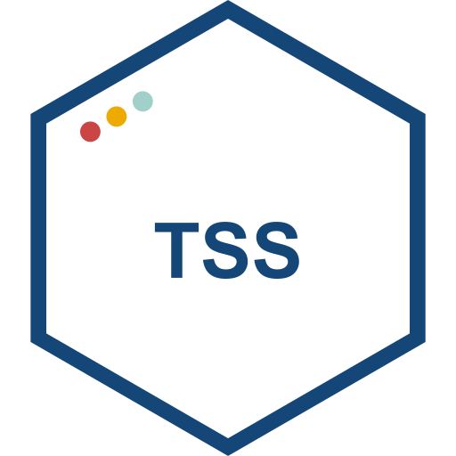
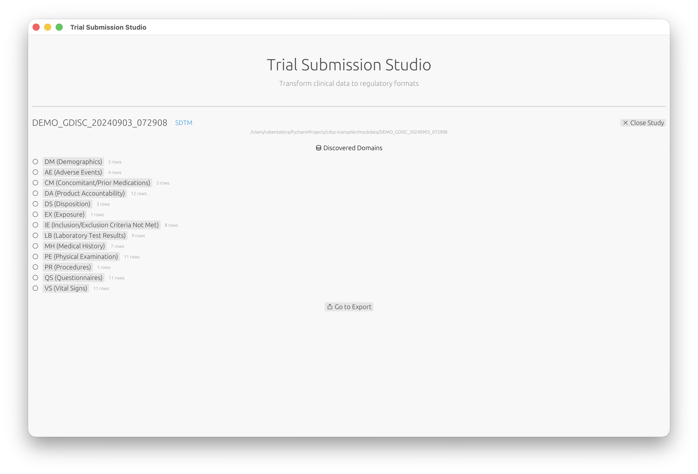

<div align="center">
  

  <h1>Trial Submission Studio</h1>

  <p><strong>Transform clinical trial data into FDA-compliant CDISC formats</strong></p>

  <p>
    <a href="LICENSE"></a>
    <a href="https://www.rust-lang.org/"></a>
    <a href="https://github.com/rubentalstra/trial-submission-studio/actions"></a>
   <!--- <a href="https://docs.rs/trial-submission-studio/"></a> -->
    <a href="https://github.com/rubentalstra/trial-submission-studio/releases"></a>
    <a href="https://deps.rs/repo/github/rubentalstra/trial-submission-studio"></a>
    <a href="https://doi.org/10.5281/zenodo.18148150"></a>
    <a href="https://archive.softwareheritage.org/browse/origin/?origin_url=https://doi.org/10.5281/zenodo.18148150">
</a>
  </p>

  <p>
    <a href="https://rubentalstra.github.io/Trial-Submission-Studio/">Documentation</a> •
    <a href="https://github.com/rubentalstra/trial-submission-studio/releases/latest">Download</a> •
    <a href="https://github.com/rubentalstra/trial-submission-studio/issues">Report Bug</a> •
    <a href="https://github.com/rubentalstra/trial-submission-studio/discussions">Discussions</a>
  </p>
</div>


> [!CAUTION]
> **ALPHA SOFTWARE** - Active development. Not for production regulatory submissions.
> See [Disclaimer](https://rubentalstra.github.io/Trial-Submission-Studio/legal/disclaimer.html).

<div align="center">
  
  <p><em>Automatic domain discovery from your clinical trial data</em></p>
</div>

## Features

| Feature                 | Description                                  |
|-------------------------|----------------------------------------------|
| **Multi-format Output** | XPT V5/V8, Dataset-XML, Define-XML 2.1       |
| **Intelligent Mapping** | Fuzzy column matching with confidence scores |
| **CDISC Validation**    | Built-in Controlled Terminology checks       |
| **Cross-platform**      | macOS, Windows, Linux native apps            |
| **Offline**             | All standards embedded, no internet required |
| **Open Source**         | MIT License, free forever                    |

<details>
<summary><strong>Table of Contents</strong></summary>

- [Installation](#installation)
- [Quick Start](#quick-start)
- [Supported Standards](#supported-standards)
- [Documentation](#documentation)
- [Architecture](#architecture)
- [Contributing](#contributing)
- [License](#license)

</details>

## Installation

Download the latest release for your platform:

| Platform | Architecture              | Download                                                                               |
|----------|---------------------------|----------------------------------------------------------------------------------------|
| macOS    | Apple Silicon (M1/M2/M3+) | [`.dmg`](https://github.com/rubentalstra/trial-submission-studio/releases/latest)      |
| macOS    | Intel (x86_64)            | [`.dmg`](https://github.com/rubentalstra/trial-submission-studio/releases/latest)      |
| Windows  | x86_64                    | [`.exe`](https://github.com/rubentalstra/trial-submission-studio/releases/latest)      |
| Windows  | ARM64                     | [`.exe`](https://github.com/rubentalstra/trial-submission-studio/releases/latest)      |
| Linux    | x86_64                    | [`.AppImage`](https://github.com/rubentalstra/trial-submission-studio/releases/latest) |
| Linux    | ARM64                     | [`.AppImage`](https://github.com/rubentalstra/trial-submission-studio/releases/latest) |

<details>
<summary><strong>Build from Source</strong></summary>

```bash
# Requires Rust 1.92+
git clone https://github.com/rubentalstra/trial-submission-studio.git
cd trial-submission-studio
cargo build --release
cargo run --package tss-gui
```

</details>

## Quick Start

1. **Import** your CSV source data
2. **Select** target SDTM domain (DM, AE, VS, etc.)
3. **Map** columns using intelligent suggestions
4. **Validate** against CDISC standards
5. **Export** to XPT, Dataset-XML, or Define-XML

## Supported Standards

| Standard               | Version   | Status    |
|------------------------|-----------|-----------|
| SDTM-IG                | v3.4      | Supported |
| Controlled Terminology | 2024-2025 | Supported |
| ADaM-IG                | v1.3      | Planned   |
| SEND-IG                | v3.1.1    | Planned   |

## Documentation

**[Read the full documentation →](https://rubentalstra.github.io/Trial-Submission-Studio/)**

- [Getting Started](https://rubentalstra.github.io/Trial-Submission-Studio/getting-started/installation.html)
- [User Guide](https://rubentalstra.github.io/Trial-Submission-Studio/user-guide/ui-overview.html)
- [CDISC Standards](https://rubentalstra.github.io/Trial-Submission-Studio/cdisc-standards/overview.html)
- [Architecture](https://rubentalstra.github.io/Trial-Submission-Studio/architecture/overview.html)

## Architecture

11-crate Rust workspace designed for modularity:

```
tss-gui         → Desktop application (egui/eframe)
tss-xpt         → XPT format I/O
tss-validate    → Conformance validation
tss-map         → Column mapping engine
tss-transform   → Data transformations
tss-ingest      → CSV loading
tss-output      → Multi-format export
tss-standards   → CDISC standards loader
tss-model       → Core types
tss-common      → Shared utilities
tss-updater     → Auto-update functionality
```

## Contributing

We welcome contributions! See [CONTRIBUTING.md](CONTRIBUTING.md) for guidelines.

- [Development Setup](https://rubentalstra.github.io/Trial-Submission-Studio/contributing/development-setup.html)
- [Coding Standards](https://rubentalstra.github.io/Trial-Submission-Studio/contributing/coding-standards.html)
- [Pull Request Guidelines](https://rubentalstra.github.io/Trial-Submission-Studio/contributing/pull-requests.html)

## Acknowledgments

Built with:

- [CDISC](https://www.cdisc.org/) standards
- [Polars](https://pola.rs/) DataFrame library
- [egui](https://github.com/emilk/egui) GUI framework
- [RapidFuzz](https://github.com/rapidfuzz/rapidfuzz-rs) string matching

## License

[MIT License](LICENSE) - Copyright (c) 2026 Ruben Talstra

## Code Signing

Windows releases are signed for security. Free code signing provided by
[SignPath.io](https://signpath.io), certificate by
[SignPath Foundation](https://signpath.org).

See
our [Code Signing Policy](https://rubentalstra.github.io/Trial-Submission-Studio/development/code-signing-policy.html)
and [Privacy Policy](PRIVACY.md).
