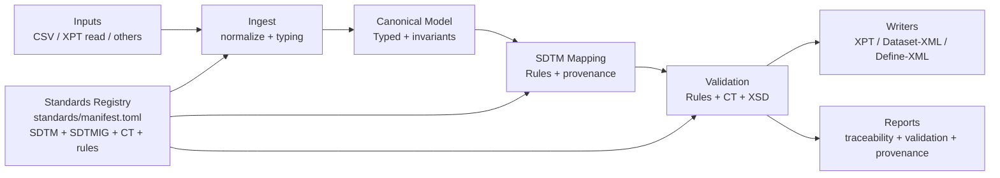

# CDISC Transpiler (Rust) — End-to-End Refactor/Rebuild Plan

## Executive Summary

### Goals

- Deliver a **100% Rust** CLI tool that runs **fully offline** and transpiles
  clinical trial source data into **CDISC SDTM** outputs.
- Produce correct, deterministic, auditable outputs:
  - **SAS V5 Transport (XPT)**
  - **Dataset-XML v1.0**
  - **Define-XML v2.1**
  - Optional **SAS exports/scripts** (as outputs only, not required for
    correctness).
- Make **validation first-class**: conformance, CT, and XML schema checks run as
  explicit pipeline stages and **fail CI** on violations.
- Keep architecture **lean**: clear boundaries, dependency direction, typed
  components, and minimal dependencies.

### Constraints (non-negotiable)

- **Language**: end-state is **Rust-only**. No Python runtime, no Python
  bridges, no “call Python from Rust”.
- **Offline runtime**: no network access, no runtime fetching of CT/standards.
  All standards + CT + assets are committed.
- **Standards-driven**: SDTM v2.0 + SDTMIG v3.4 + Conformance Rules v2.0 +
  Define-XML 2.1 + Dataset-XML 1.0.
- **Output correctness**:
  - deterministic mapping
  - full provenance (source → derived SDTM)
  - validation gates that fail the build when violated
- **Lean architecture**:
  - mapping and validation must be unit-testable
  - writers contain **no mapping logic**
  - dependencies must be justified

### Non-goals (explicit)

- Online CT or standards updates.
- “Auto-magic” mapping driven by LLMs or network services.
- Perfect support for every sponsor’s custom nuances on day one.
- Building an interactive UI; the primary product is a CLI.

---

## Current State Assessment (Repo Deep Dive)

This repository is currently a **Python** implementation with a ports/adapters
flavor.

### Entrypoints / CLI

- CLI entrypoint is Click-based:
  [cdisc_transpiler/cli/commands/study.py](../cdisc_transpiler/cli/commands/study.py)
  and [cdisc_transpiler/cli/**main**.py](../cdisc_transpiler/cli/__main__.py).
- Current README still documents Python install/run flows:
  [README.md](../README.md).

### “Standards registry” and reference assets

- SDTMIG v3.4 assets currently live under docs: [docs/SDTMIG_v3.4](SDTMIG_v3.4).
- SDTM v2.0 assets currently live under docs: [docs/SDTM_v2.0](SDTM_v2.0).
- CT currently lives under docs with dated folders:
  [docs/Controlled_Terminology](Controlled_Terminology).
- The current “registry” for domains reads CSVs from configured folders and
  caches in-process:
  - [cdisc_transpiler/infrastructure/sdtm_spec/registry.py](../cdisc_transpiler/infrastructure/sdtm_spec/registry.py)

**Observed issues**

- Asset locations do not match the required standardized layout (must be under
  standards/).
- Registry resolution is implicit (searches SDTMIG first, then SDTM v2.0 for a
  domain) and lacks:
  - explicit **precedence policy** reporting
  - manifest pinning and checksums
  - deterministic provenance surface in outputs.

### Mapping / canonicalization boundaries

- Study-level orchestration is large and blends concerns:
  - [cdisc_transpiler/application/study_processing_use_case.py](../cdisc_transpiler/application/study_processing_use_case.py)
- Domain-level processing also blends mapping, validation gating, and output
  orchestration:
  - [cdisc_transpiler/application/domain_processing_use_case.py](../cdisc_transpiler/application/domain_processing_use_case.py)

**Evidence of duplication / boundary erosion**

- Conformance report logging and CT resolver logic appears duplicated between:
  - StudyProcessingUseCase._log_conformance_report
  - DomainProcessingUseCase._log_conformance_report in the files above.

### Validation

- Current conformance checking is primarily:
  - required/expected column presence
  - required value presence
  - CT value checks with a few special cases via
    [cdisc_transpiler/domain/services/sdtm_conformance_checker.py](../cdisc_transpiler/domain/services/sdtm_conformance_checker.py).

**Gaps vs requirements**

- No explicit engine for **SDTM/SDTMIG Conformance Rules v2.0** with rule IDs,
  categories, and a structured rule set representation.
- No schema validation gate for Define-XML/Dataset-XML using XSD (current tests
  only check “well-formedness”).

### Writers

- XPT writing currently depends on pyreadstat:
  - [cdisc_transpiler/infrastructure/io/xpt_writer.py](../cdisc_transpiler/infrastructure/io/xpt_writer.py)
- Dataset-XML writing uses xml.etree and iterrows:
  - [cdisc_transpiler/infrastructure/io/dataset_xml_writer.py](../cdisc_transpiler/infrastructure/io/dataset_xml_writer.py)
- Define-XML generation logic is large and coupled to CT repository defaults:
  - [cdisc_transpiler/infrastructure/io/define_xml/xml_writer.py](../cdisc_transpiler/infrastructure/io/define_xml/xml_writer.py)

**Observed issues**

- Writers and metadata generation currently pull domain/CT information via
  global-ish registries (default CT repository, SDTM spec registry). This makes
  provenance, determinism, and testing isolation harder.
- Output correctness requirements (traceability, deterministic mapping, CI fail
  gates) are not encoded as a single explicit pipeline with clear stage
  boundaries.

### Configuration

- Config and config-loading is Python + env + TOML:
  - [cdisc_transpiler/config.py](../cdisc_transpiler/config.py)
  - [cdisc_transpiler.toml](../cdisc_transpiler.toml)

### Rust status

- No Rust code exists yet (no .rs files were found). This plan covers a full
  Rust rewrite.

---

## Target Architecture

### Pipeline stages (hard boundaries)

1. **Ingest**
   - Load supported inputs (initially CSV; expand later).
   - Normalize encodings, headers, missing values, and types.
   - Emit row-level records with stable source references.
2. **Canonical clinical model**
   - Typed internal representation with invariants.
   - Explicit “missing” semantics.
   - Standardized identifiers and timestamps.
3. **SDTM mapping**
   - Deterministic mapping rules.
   - Derivations are explicit, typed, and recorded as provenance steps.
   - Outputs a canonical “SDTM dataset set” (domains → tables).
4. **Validation**
   - Conformance Rules v2.0 engine (local rule corpus).
   - SDTM v2.0 + SDTMIG v3.4 structural constraints.
   - CT checks from local CT CSVs.
   - Schema validation for Define-XML 2.1 and Dataset-XML 1.0 (when XSDs are
     present locally).
5. **Writers**
   - XPT v5 writer
   - Define-XML v2.1 writer
   - Dataset-XML v1.0 writer (paired with Define-XML)
   - Optional SAS script export
6. **Reporting**
   - Traceability report (source → SDTM)
   - Validation report (JSON + Markdown/HTML)
   - Standards/CT provenance (manifest versions + sha256 + git commit)

### Determinism & provenance as first-class

- All stages must be deterministic given:
  - input bytes
  - config
  - standards manifest
  - tool version
- Every SDTM value carries lineage:
  - source file path (relative)
  - source row identity (stable record key)
  - source columns used
  - derivation steps with rule IDs

### High-level diagram



---

## Proposed Rust Workspace / Modules

### Rust toolchain policy

- **Edition**: Rust **2024**.
- **MSRV policy**: pin to a specific stable release, updated on a schedule
  (example policy: “N-2 stable”, documented and enforced in CI).
- CI enforces:
  - `cargo fmt --check`
  - `cargo clippy --all-targets --all-features -D warnings`
- Default stance: `#![deny(unsafe_code)]` for most crates.
  - If unsafe/native FFI is required (libxml2/libxslt), isolate it in dedicated
    crates and keep unsafe surface minimal.

### Cargo workspace layout (proposed)

```text
.
├─ Cargo.toml
├─ crates/
│  ├─ cdisc-cli/                 # clap CLI + comfy-table rendering (presentation only)
│  ├─ cdisc-config/              # figment config loading + config provenance
│  ├─ cdisc-standards/           # standards registry: manifest + loaders + indices
│  ├─ cdisc-ingest/              # input readers + normalization
│  ├─ cdisc-model/               # canonical clinical model + typed SDTM table types
│  ├─ cdisc-mapping/             # mapping rules engine + derivations + provenance
│  ├─ cdisc-validation/          # conformance rules engine + CT + schema gates
│  ├─ cdisc-writer-xpt/           # XPT v5 writer (write) + xpttools read (optional)
│  ├─ cdisc-writer-define-xml/    # Define-XML v2.1 writer (quick-xml)
│  ├─ cdisc-writer-dataset-xml/   # Dataset-XML v1.0 writer (quick-xml)
│  ├─ cdisc-report/              # JSON + Markdown/HTML report generators
│  ├─ cdisc-xslt/                # OPTIONAL: Define HTML rendition via libxslt
│  └─ cdisc-core/                # pipeline orchestration; no IO besides registry/config
├─ standards/                    # required offline standards layout (see next section)
├─ examples/                     # required golden fixtures layout
└─ docs/
   └─ REFRACTOR_PLAN.md
```

### Dependency direction (strict)

- `cdisc-cli` depends on `cdisc-core` and `cdisc-config` only.
- `cdisc-core` depends on:
  - `cdisc-standards`
  - `cdisc-ingest`
  - `cdisc-model`
  - `cdisc-mapping`
  - `cdisc-validation`
  - writers + report crates
- Writers depend only on:
  - `cdisc-model`
  - `cdisc-standards` (for metadata needed to render outputs)
  - `quick-xml` / XPT writer crate
- Mapping depends on:
  - `cdisc-model`
  - `cdisc-standards`
- Validation depends on:
  - `cdisc-model`
  - `cdisc-standards`

This prevents “writers contain mapping logic” and keeps validation independently
runnable.

### Crate dependency graph (allowed edges only)

This diagram is the _architecture contract_ for dependency direction. If a crate
needs data from “later” in the pipeline, it must be passed as values (e.g.,
DTOs) rather than introducing a reverse dependency. CLI presentation (tables,
colors, formatting, progress bars/spinners) stays in `cdisc-cli`.

```mermaid
flowchart LR
  subgraph CLI
    cli[cdisc-cli]
  end

  subgraph Orchestration
    core[cdisc-core]
    cfg[cdisc-config]
  end

  subgraph Foundations
    stds[cdisc-standards]
    ingest[cdisc-ingest]
    model[cdisc-model]
  end

  subgraph Pipeline
    map[cdisc-mapping]
    val[cdisc-validation]
    rpt[cdisc-report]
  end

  subgraph Outputs
    wxpt[cdisc-writer-xpt]
    wdx[cdisc-writer-dataset-xml]
    wdef[cdisc-writer-define-xml]
    xslt[cdisc-xslt (feature: xslt)]
  end

  cli --> core
  cli --> cfg

  core --> stds
  core --> cfg
  core --> ingest
  core --> model
  core --> map
  core --> val
  core --> rpt
  core --> wxpt
  core --> wdx
  core --> wdef
  core -. feature: xslt .-> xslt

  ingest --> model
  ingest --> stds

  map --> model
  map --> stds

  val --> model
  val --> stds

  wxpt --> model
  wxpt --> stds
  wdx --> model
  wdx --> stds
  wdef --> model
  wdef --> stds

  rpt --> model
  rpt --> stds

  xslt --> stds
```

### Preferred crates (and how they map)

- CLI: `clap`
- CLI tables: `comfy-table` (keep this dependency in `cdisc-cli` only)
- CLI progress: `indicatif` (keep this dependency in `cdisc-cli` only)
- Config: `figment` (include config provenance in reports)
- Serialization: `serde`, `serde_json`, `toml`
- Errors: `thiserror` (libs), `anyhow` (app)
- Logging/audit: `tracing`, `tracing-subscriber`
- Data transforms: `polars` (lazy/streaming) + `csv` + `rayon` only where
  deterministic
- XML read/write: `quick-xml`
- XML schema validation gate: libxml2 bindings (threading caveats; isolate)
- XSLT: choose **libxslt bindings** in `cdisc-xslt` (feature-gated)
- XPT:
  - Read: `xpttools` / `xpt.rs` (crate selection during implementation)
  - Write: custom Rust implementation in `cdisc-writer-xpt`
- Testing: `cargo-nextest`, `insta`, `proptest`, `criterion`

---

## Standards + CT + Assets: Required Repo Layout (Migration Included)

### Required target layout

```text
standards/
  manifest.toml
  sdtm/
    v2_0/
      Datasets.csv
      Variables.csv
      README.md
  sdtmig/
    v3_4/
      Datasets.csv
      Variables.csv
      README.md
  conformance_rules/
    v2_0/
      ...
      README.md
  ct/
    2024-03-29/
      SDTM_CT_2024-03-29.csv
      Define-XML_CT_2024-03-29.csv
      ADaM_CT_2024-03-29.csv
      SEND_CT_2024-03-29.csv
      MRCT_CT_2024-03-29.csv
      Protocol_CT_2024-03-29.csv
      DDF_CT_2024-03-29.csv
      README.md
  xsl/
    define2-1.xsl
    define2-0-0.xsl
    README.md

examples/
  define_xml/
    v2_1/
      ...
  dataset_xml/
    v1_0/
      ...
  xpt/
    v5/
      ...
  mappings/
    ...
```

### Migration mapping from current repo

- Move standards CSVs:
  - from docs/SDTM_v2.0 → standards/sdtm/v2_0
  - from docs/SDTMIG_v3.4 → standards/sdtmig/v3_4
- Move CT:
  - from docs/Controlled_Terminology/2024-03-29 → standards/ct/2024-03-29
  - from docs/Controlled_Terminology/2025-09-26 → standards/ct/2025-09-26
- Move XSL stylesheets:
  - from docs/Define-XML_2.1/stylesheets (and any known-good XSLs) →
    standards/xsl
- Add conformance rules:
  - create standards/conformance_rules/v2_0 with a locally-encoded
    representation (see next section)
- Add examples:
  - curate outputs from mockdata runs into examples/ as golden fixtures

### Standards manifest (authoritative)

Create standards/manifest.toml as the single source of truth for:

- versions in use (SDTM v2.0, SDTMIG v3.4, conformance rules v2.0, CT date)
- file inventory (paths) and sha256 checksums
- human notes on provenance and any known deviations

Example shape (conforming v1):

```toml
[manifest]
schema = "cdisc-transpiler.standards-manifest"
schema_version = 1

[pins]
sdtm = "v2_0"
sdtmig = "v3_4"
conformance_rules = "v2_0"
ct = "2025-09-26"

[[files]]
path = "sdtm/v2_0/Variables.csv"
sha256 = "<64 lowercase hex chars>"
kind = "csv"
role = "sdtm_variables"
notes = "Imported from CDISC SDTM v2.0 package"

[[files]]
path = "ct/2025-09-26/SDTM_CT_2025-09-26.csv"
sha256 = "<64 lowercase hex chars>"
kind = "csv"
role = "ct_sdtm"
notes = "NCI Thesaurus export"
```

CI gates:

- fail if any required files are missing
- fail if sha256 mismatch vs manifest
- fail if new files appear without manifest updates

### standards/manifest.toml schema (exact)

This project treats the manifest as _the authoritative, machine-validated
registry_. The loader MUST reject any manifest that does not conform to this
schema.

File location: [standards/manifest.toml](../standards/manifest.toml)

#### Schema v1 (normative)

```toml
[manifest]
schema = "cdisc-transpiler.standards-manifest"
schema_version = 1

# Optional but strongly recommended: documents human intent
[notes]
summary = "Offline standards registry for CDISC transpiler"

# Version pins (logical identifiers), referenced by config and provenance
[pins]
sdtm = "v2_0"
sdtmig = "v3_4"
conformance_rules = "v2_0"
ct = "2025-09-26"

# Optional: policy knobs that affect deterministic behavior
[policy]
# Precedence when both SDTM and SDTMIG define attributes
precedence = "sdtm_then_sdtmig"  # allowed: "sdtm_then_sdtmig" | "sdtmig_overrides_sdtm"

[[files]]
# Path is ALWAYS relative to standards/ and uses forward slashes.
path = "sdtm/v2_0/Datasets.csv"
sha256 = "<64 lowercase hex chars>"
kind = "csv"                     # allowed: "csv" | "json" | "toml" | "xsd" | "xsl" | "pdf" | "other"
role = "sdtm_datasets"           # role drives requiredness and loader routing
notes = "Imported from SDTM v2.0 package"

[[files]]
path = "sdtm/v2_0/Variables.csv"
sha256 = "<64 lowercase hex chars>"
kind = "csv"
role = "sdtm_variables"

[[files]]
path = "sdtmig/v3_4/Datasets.csv"
sha256 = "<64 lowercase hex chars>"
kind = "csv"
role = "sdtmig_datasets"

[[files]]
path = "sdtmig/v3_4/Variables.csv"
sha256 = "<64 lowercase hex chars>"
kind = "csv"
role = "sdtmig_variables"

[[files]]
path = "ct/2025-09-26/SDTM_CT_2025-09-26.csv"
sha256 = "<64 lowercase hex chars>"
kind = "csv"
role = "ct_sdtm"

[[files]]
path = "conformance_rules/v2_0/catalog.toml"
sha256 = "<64 lowercase hex chars>"
kind = "toml"
role = "conformance_rules_catalog"

[[files]]
path = "xsl/define2-1.xsl"
sha256 = "<64 lowercase hex chars>"
kind = "xsl"
role = "define_xsl_2_1"

[[files]]
path = "xsl/define2-0-0.xsl"
sha256 = "<64 lowercase hex chars>"
kind = "xsl"
role = "define_xsl_2_0"
```

#### Required roles (v1)

The registry MUST fail to load if any of these roles are missing from the
manifest or the file is unreadable:

- sdtm_datasets
- sdtm_variables
- sdtmig_datasets
- sdtmig_variables
- conformance_rules_catalog
- define_xsl_2_1
- define_xsl_2_0

For CT, at least one of the following MUST be present (more are recommended and
can be used by later features):

- ct_sdtm
- ct_define_xml

#### Checksum computation (normative)

- sha256 is computed over the **raw file bytes** as stored in git (no newline
  normalization, no CSV parsing).
- The verifier reads each file as bytes and hashes it with SHA-256.
- Any mismatch is a hard failure in:
  - the `standards verify` command
  - CI
  - runtime startup (unless an explicit `--no-standards-verify` escape hatch is
    implemented for developer-only workflows; default must remain strict).

---

---

## Offline Standards Registry (Design)

### Responsibilities

`cdisc-standards` loads everything under standards/ and offers typed APIs:

- SDTM v2.0 datasets + variables
- SDTMIG v3.4 datasets + variables
- CT CSVs for the pinned CT date
- Conformance rules corpus v2.0
- XSL assets metadata (paths + checksums)

### Parsing and indices

- Parse CSVs into typed structs:
  - Domain/Dataset metadata (name, class, structure, labels)
  - Variable metadata keyed by (domain, variable)
  - CT codelists keyed by:
    - codelist code
    - codelist name
    - term (submission value)
- Build deterministic lookup indices:
  - domain_by_code
  - variable_by_domain_and_name
  - ct_by_codelist_code
  - ct_by_codelist_name

### Precedence and conflict handling (SDTM vs SDTMIG)

Policy (deterministic and reported):

1. **SDTM v2.0** defines baseline dataset + variable model.
2. **SDTMIG v3.4** refines:
   - variable presence expectations
   - implementation notes and tabulation constraints
3. If conflicts exist:
   - resolve deterministically (prefer SDTMIG where it refines SDTM)
   - record a machine-readable “conflict report” emitted in the validation
     report and optionally saved as JSON.

### Provenance surfaces

The registry must expose provenance to:

- Define-XML outputs (standards versions and CT date)
- validation report
- traceability report

Provenance record includes:

- standards versions from manifest
- file paths + sha256 from manifest
- git commit hash of the tool build (embedded at build time)

---

## Conformance Rules v2.0 (Local Representation + Engine)

### Representation requirements

- Must be committed under standards/conformance_rules/v2_0.
- Must be stable, reviewable, and diff-friendly.

Recommended structure:

- catalog.toml (or JSON) containing:
  - rule_id
  - title
  - category
  - severity (error/warning)
  - applicability scope (domain(s), variable(s), class)
  - predicate definition (data checks)
  - message template

### Conformance rules folder layout (exact)

Target location:
[standards/conformance_rules/v2_0](../standards/conformance_rules/v2_0)

```text
standards/conformance_rules/v2_0/
  README.md
  catalog.toml
  predicates/
    builtin.toml
    sdtm_core.toml
    sdtmig_tabulation.toml
```

Rationale: split the catalog (rule metadata + stable IDs) from the predicate
library (reusable checks), so you can update rule mappings without rewriting
evaluation code.

### catalog.toml schema (exact)

File:
[standards/conformance_rules/v2_0/catalog.toml](../standards/conformance_rules/v2_0/catalog.toml)

```toml
[catalog]
schema = "cdisc-transpiler.conformance-rules"
schema_version = 1
ruleset = "sdtm-sdtmig-conformance"
ruleset_version = "v2_0"

[[rule]]
id = "CR-REQ-0001"                # stable rule ID (never renumber once shipped)
title = "Required variable must be present"
category = "requiredness"
severity = "error"               # allowed: "error" | "warning"

# Applicability determines which datasets/variables the rule is evaluated against.
[rule.scope]
domains = ["DM", "AE"]            # empty or omitted means "all"
variables = ["USUBJID"]           # empty or omitted means "all"
classes = []                       # optional SDTM class filters

# Predicate references a named predicate and supplies parameters.
[rule.predicate]
name = "column_present"
params = { column = "${var}" }    # ${var} means "the variable currently in scope"

message = "Missing required variable ${var}"

[[rule]]
id = "CR-CT-0001"
title = "CT values must exist (non-extensible)"
category = "controlled-terminology"
severity = "error"

[rule.scope]
domains = ["*"]                   # '*' means "all domains"
variables = ["*"]                 # '*' means "all variables"

[rule.predicate]
name = "ct_membership"
params = { codelist = "${codelist_code}", extensible_ok = false }

message = "Invalid CT value(s) for ${var} (codelist ${codelist_code})"
```

### Predicate library schema (exact)

Predicate definitions live under predicates/*.toml. Each predicate has a name, a
type, and a typed params contract.

Example:
[standards/conformance_rules/v2_0/predicates/builtin.toml](../standards/conformance_rules/v2_0/predicates/builtin.toml)

```toml
[predicates]
schema = "cdisc-transpiler.conformance-predicates"
schema_version = 1

[[predicate]]
name = "column_present"
kind = "table"                    # allowed: "table" | "row" | "cross_table"
params = { column = "string" }

[[predicate]]
name = "non_missing"
kind = "row"
params = { column = "string" }

[[predicate]]
name = "regex_match"
kind = "row"
params = { column = "string", pattern = "string" }

[[predicate]]
name = "unique_key"
kind = "table"
params = { columns = "string[]" }

[[predicate]]
name = "ct_membership"
kind = "row"
params = { codelist = "string", extensible_ok = "bool" }
```

### Findings schema (output contract)

The validation stage MUST produce machine JSON where each finding includes
stable IDs and traceable row references.

```json
{
    "schema": "cdisc-transpiler.validation-report",
    "schema_version": 1,
    "generated_at": "2025-12-24T12:00:00Z",
    "study_id": "...",
    "standards_provenance": { "manifest_sha256": "...", "git_commit": "..." },
    "summary": { "errors": 12, "warnings": 5 },
    "findings": [
        {
            "severity": "error",
            "rule_id": "CR-REQ-0001",
            "category": "requiredness",
            "domain": "DM",
            "variable": "USUBJID",
            "message": "Missing required variable USUBJID",
            "count": 1,
            "examples": [
                {
                    "row_ref": { "dataset": "DM", "row_id": "dm:000042" },
                    "source_refs": [
                        { "path": "inputs/dm.csv", "row": 43, "column": "subj" }
                    ]
                }
            ]
        }
    ]
}
```

### Engine abstraction

`cdisc-validation` provides:

- a rule runner interface:
  - input: SDTM datasets + registry
  - output: validation findings (with rule_id, domain, variable, row refs)
- pluggable backends:
  - “table rules” (column presence, type/length, uniqueness)
  - “cross-domain rules” (RELREC, SUPP--)
  - “CT rules” (value sets with extensibility)

### FAIL conditions

- Any “error” finding fails the run and fails CI.
- Warnings are reported; optionally fail in “strict” mode.

---

## CT Strategy (Offline, Version-Pinned, Enforced)

### CT pinning

- CT date/version is selected via config (default comes from
  standards/manifest.toml).
- Per-study override is allowed via config, but must be:
  - a folder that exists under standards/ct/
  - recorded in provenance outputs.

### Enforcement behavior

- For non-extensible codelists: invalid values are **errors**.
- For extensible codelists: invalid values are **warnings** (still reported,
  still traceable).
- Suggestion logic may be implemented offline (synonym maps or normalization)
  but must never mutate the actual values unless explicitly configured as a
  mapping rule.

---

## SDTM-Specific Design Details (Must-Haves)

### Domain identification & mapping strategy

- Support two mapping modes:
  1. **Standard domain mapping**: map to known SDTM domains using registry
     metadata.
  2. **Custom domain strategy**: allow sponsor-specific inputs to map into SDTM
     domains via explicit rule packs, not ad-hoc code.

Domain identification algorithm (deterministic):

- Prefer explicit config: “this input file maps to domain AE”.
- Else infer using:
  - filename hints
  - column signature match to known domain variable sets
  - minimum-confidence threshold
- Always emit “why we chose this domain” into traceability.

### Identifiers, timing, qualifiers

- Canonical model defines strongly typed concepts:
  - SubjectId (USUBJID)
  - StudyId (STUDYID)
  - DomainCode (DOMAIN)
  - Sequence numbers (*SEQ)
  - Dates/times in ISO 8601 (DTC)
- Mapping stage enforces:
  - consistent generation of sequence variables
  - timing variables normalization (e.g., --DTC, --DY) with explicit derivation
    rules

### SUPP-- and RELREC strategy

- SUPP--
  - Build SUPP domains only as a post-mapping synthesis step.
  - Ensure QNAM constraints (<= 8) and controlled construction.
  - Provenance: each SUPP row points back to the parent domain record and source
    fields.
- RELREC
  - Relationship generation is a deterministic synthesis stage.
  - RELREC validation runs after synthesis.

### Define-XML generation requirements

- Must populate:
  - dataset-level metadata
  - variable-level metadata
  - value-level metadata (ValueListDef/WhereClauseDef) where required
  - standards + CT version identification sourced from standards/manifest.toml
  - origins/provenance where applicable
- Must include a standards provenance block that reflects:
  - manifest versions
  - sha256
  - git commit

### Dataset-XML strategy and relationship to Define-XML

- Dataset-XML v1.0 requires paired Define-XML for metadata.
- Generation plan:
  - Generate Define-XML first (metadata version OID stable)
  - Generate Dataset-XML referencing Define’s MetaDataVersionOID and correct
    ItemOIDs
- Validation gate:
  - Validate Define-XML and Dataset-XML against local XSDs (when present)

### Traceability guarantees

- Every SDTM cell has:
  - source(s) (file, row, column)
  - derivation rule IDs
  - transformation steps
- Reports must allow “drill-down” from SDTM value to the exact input value(s)
  and logic.

---

## Writers Strategy

### XPT (SAS V5 Transport)

- Implement a Rust XPT v5 writer with strict constraints:
  - dataset name <= 8
  - variable names <= 8
  - label constraints
  - types and missing semantics
- Add compliance checks:
  - round-trip: write → read back → compare schema + values
  - compare against golden XPT samples under examples/xpt/v5
- Read support can use an existing crate (xpttools/xpt.rs) for test
  verification.

### Define-XML v2.1

- Generate via `quick-xml` (streaming) to avoid large in-memory DOM.
- Use registry for metadata and codelists.
- Embed provenance and standards references.

### Dataset-XML v1.0

- Generate via `quick-xml`.
- Ensure correct namespaces and ItemGroupData sequencing.
- Ensure stable OID generation.

### Optional SAS outputs

- Treat as an “export” format:
  - no SAS execution in the pipeline
  - mapping logic stays in Rust
- SAS scripts should include comments referencing provenance IDs.

---

## XSLT / HTML Rendition Strategy (Feature-Gated)

### Choice

- Choose **libxslt bindings** (Rust crate wrapping libxslt) as an **optional
  feature**.

Justification:

- Offline runtime-friendly (no network; no need to download tools).
- Deterministic rendering when version-pinned.
- Can be isolated into a small crate with a narrow unsafe/FFI surface.

### Design

- Crate: cdisc-xslt
- Feature flag: xslt
- Inputs:
  - define.xml
  - standards/xsl/define2-1.xsl
- Output:
  - define.html (or folder, depending on stylesheet behavior)

### Testing

- When xslt feature enabled:
  - render define.xml → html
  - snapshot HTML with insta
- Keep a set of known-good HTML outputs under examples/define_xml/v2_1.

---

## Validation Strategy (CI-Failing Gates)

Validation stage must produce machine-readable and human-readable output.

### Gates (must fail CI)

- Conformance rules v2.0 violations (severity=error)
- CT violations using local CT CSVs (non-extensible → error)
- Define/Dataset-XML schema validation failures (when schemas present locally)
- XPT writer compliance checks (format constraints + round-trip)

### Schema validation implementation

- Use libxml2-based validation in an isolated crate or module.
- Threading caveat: run schema validation single-threaded or behind a mutex.

---

## Testing Strategy

### Unit tests

- Standards registry parsing + indices
- Mapping rules and derivations (deterministic)
- Validation rules engine
- XPT writer (header/record encoding; constraints)

### Integration tests (end-to-end)

- Use examples/mappings fixtures:
  - input source
  - expected SDTM outputs
  - expected reports

### Golden/snapshot tests

- Define-XML and Dataset-XML:
  - compare generated XML against golden files in examples/
- HTML rendition (feature-gated):
  - snapshot HTML using insta

### Property tests

- XPT writer:
  - generate random tables within constraints
  - write + read back
  - assert invariants and determinism

### Performance tests

- Benchmarks with criterion for:
  - ingest parsing
  - mapping on typical domains
  - XPT writing

---

## Performance Strategy (Large Studies)

- Use Polars lazy/streaming where possible.
- Avoid global mutable caches; prefer explicit caches inside a run context.
- Deterministic parallelism:
  - allow parallel domain processing only if:
    - order does not affect output
    - writers produce stable ordering
    - reports are sorted deterministically

---

## Security / Privacy Strategy

- Treat all input datasets as potentially containing PHI/PII.
- Logging policy:
  - default logs never print raw values
  - enable redacted sampling only behind explicit flags
- Reports:
  - validation findings should reference row IDs and field names, not raw
    sensitive values, unless explicitly configured
- Provenance:
  - store hashed row identifiers where appropriate

---

## Migration Plan (Incremental, Keep Main Releasable)

Principle: introduce Rust as a new workspace while keeping current main branch
operational; then cut over to Rust-only and remove Python.

### Step-by-step “commit plan” (10+ increments)

1. **Commit 1: Add Rust workspace skeleton**
   - Add top-level Cargo.toml workspace
   - Add crates/cdisc-cli with clap “hello” command
   - Add CI jobs for cargo fmt/clippy/nextest

2. **Commit 2: Add standards/ and examples/ directories + move assets**
   - Create standards/ tree per required layout
   - Move docs/SDTM_v2.0 → standards/sdtm/v2_0
   - Move docs/SDTMIG_v3.4 → standards/sdtmig/v3_4
   - Move docs/Controlled_Terminology → standards/ct
   - Add standards/xsl and move XSLs

3. **Commit 3: Add standards/manifest.toml + checksum verifier**
   - Implement cdisc-standards manifest loader
   - Implement sha256 verification gate and a small CLI command:
     `standards verify`

4. **Commit 4: Implement Standards Registry (typed) + indices**
   - Parse SDTM/SDTMIG Datasets.csv + Variables.csv
   - Parse CT CSVs into codelist/term structures
   - Implement deterministic precedence resolution and conflict report

5. **Commit 5: Add canonical model crate**
   - Implement core typed IDs, timestamps, missing semantics
   - Implement provenance types (source ref + derivation steps)

6. **Commit 6: Implement ingest for CSV (offline)**
   - csv reader
   - normalize headers + missing values
   - stable row identity

7. **Commit 7: Implement mapping engine (minimal DM + AE)**
   - deterministic mapping rules
   - provenance emitted per cell
   - unit tests for derivations and determinism

8. **Commit 8: Implement validation engine (phase 1)**
   - CT checks using registry
   - structural checks using SDTM/SDTMIG metadata
   - JSON validation report
   - CI fails on errors

9. **Commit 9: Implement writers (phase 1)**
   - Dataset-XML writer + Define-XML writer using quick-xml
   - golden tests using examples/

10. **Commit 10: Implement XPT v5 writer + compliance tests**

- writer crate with strict constraints
- round-trip tests using an XPT reader crate
- golden XPT tests

11. **Commit 11: Add schema validation gate (when XSDs present)**

- add standards/xsd (if you commit schemas)
- implement libxml2 schema validation feature

12. **Commit 12: Add optional XSLT HTML rendition feature**

- cdisc-xslt crate behind feature flag
- insta snapshot tests for HTML

13. **Commit 13: Cutover and remove Python**

- Replace packaging/entrypoints with Rust binary distribution
- Remove Python-only runtime code and docs references
- Keep only examples, standards, and Rust toolchain

---

## Delivery Milestones + Acceptance Criteria

### Milestone A: Offline standards registry complete

- `standards verify` passes locally and in CI
- Registry loads SDTM v2.0 + SDTMIG v3.4 + CT from manifest
- Conflict reporting exists and is deterministic

### Milestone B: Minimal end-to-end pipeline (DM + AE)

- Ingest → model → mapping → validation → writers runs offline
- Produces Define-XML + Dataset-XML + XPT for fixtures
- Validation report produced (JSON + Markdown)

### Milestone C: Full validation gates

- Conformance rules v2.0 engine runs and fails CI on errors
- CT enforcement is pinned and reported
- XML schema validation gate present (when schemas are committed)

### Milestone D: Cutover to Rust-only

- Python package no longer required to build or run
- Repo is a Rust workspace + committed standards/assets + examples

---

## Definition of Done (Compliance + Correctness + Provenance)

Checklist:

- [ ] Tool is 100% Rust (no Python runtime, no Python bridges)
- [ ] Runs fully offline; uses only standards/ assets committed in repo
- [ ] standards/manifest.toml is authoritative and checksum-validated in CI
- [ ] Deterministic outputs given same inputs/config/manifest/tool version
- [ ] Every SDTM value has traceability to source row/field + derivation rule
- [ ] Validation stage exists and is CI-gating:
  - [ ] Conformance rules v2.0 errors fail
  - [ ] CT non-extensible violations fail
  - [ ] Define/Dataset XML schema violations fail when schemas present
  - [ ] XPT compliance checks fail on violations
- [ ] Writers contain no mapping logic
- [ ] Golden fixtures exist under examples/ and are enforced in CI

---

## Multi-Agent Plan (Roles, IO, DoD)

Each “agent” is a focused workstream with explicit inputs/outputs and measurable
acceptance criteria.

### 1) Repo Auditor Agent

- Mission: produce an evidence-backed map of current repo boundaries and pain
  points.
- Inputs: current tree, key modules (application/, domain/, infrastructure/),
  docs/ assets.
- Outputs:
  - module inventory
  - dependency/coupling notes
  - list of duplicated logic and boundary violations with file references
- DoD:
  - report cites specific files and concrete observations
  - identifies ingestion/mapping/validation/writers tangling

### 2) Standards Assets Agent

- Mission: migrate assets into standards/ and generate manifest with checksums.
- Inputs: docs/SDTM_v2.0, docs/SDTMIG_v3.4, docs/Controlled_Terminology, XSL
  sources.
- Outputs:
  - standards/ layout
  - standards/manifest.toml
  - verification command that fails on drift
- DoD:
  - CI fails on missing files or checksum mismatches

### 3) Standards & Compliance Agent

- Mission: encode SDTM/SDTMIG rules and conformance rules v2.0 locally; define
  validation semantics.
- Inputs: standards CSVs, conformance rule corpus (local representation),
  Define/Dataset constraints, XPT constraints.
- Outputs:
  - rule representation spec
  - mapping of rule IDs → checks
  - severity policy
- DoD:
  - representative rules implemented with stable rule IDs and reproducible
    outputs

### 4) Architecture Agent

- Mission: design cargo workspace, crate boundaries, features, MSRV policy, CI
  setup.
- Inputs: constraints + preferred crates.
- Outputs:
  - workspace layout
  - dependency direction rules
  - feature flags (`xslt`, `schema-validation`)
- DoD:
  - `cargo fmt`/`clippy`/`nextest` green on CI

### 5) Canonical Model Agent

- Mission: define typed internal model and invariants.
- Inputs: SDTM concepts, provenance requirements.
- Outputs:
  - canonical types
  - provenance graph model
  - conversion rules to SDTM table representation
- DoD:
  - unit tests for invariants + deterministic IDs

### 6) Mapping/Derivations Agent

- Mission: implement deterministic mapping rule engine with auditable
  provenance.
- Inputs: canonical model + registry metadata.
- Outputs:
  - rule DSL or typed rule structs
  - derivation step recording
  - domain identification algorithm
- DoD:
  - mapping is unit-testable; given inputs + config, outputs match golden
    fixtures

### 7) Validation Agent

- Mission: implement validation pipeline and reports.
- Inputs: mapped SDTM datasets + standards registry.
- Outputs:
  - conformance rule runner
  - CT checks
  - schema validation gate
  - JSON + Markdown reports
- DoD:
  - CI fails on defined gate violations

### 8) Output Agent

- Mission: implement Define-XML, Dataset-XML, XPT writer, optional SAS exports.
- Inputs: SDTM datasets + registry + provenance.
- Outputs:
  - writers with deterministic ordering
  - compliance checks
- DoD:
  - golden tests pass; round-trip tests for XPT pass

### 9) XSLT/HTML Rendition Agent

- Mission: optional HTML rendition feature.
- Inputs: standards/xsl stylesheets + generated define.xml.
- Outputs:
  - feature-gated renderer
  - insta snapshots
- DoD:
  - snapshots stable across runs; feature can be disabled without affecting core
    pipeline

### 10) QA Agent

- Mission: enforce test pyramid and CI gates.
- Inputs: examples/ fixtures, outputs, reports.
- Outputs:
  - nextest profile
  - golden snapshot harness
  - CI checks
- DoD:
  - reproducible tests; failures are actionable and localized

### 11) Performance Agent

- Mission: ensure scalability and predictability.
- Inputs: large-study constraints.
- Outputs:
  - streaming strategies
  - benchmarks and budgets
- DoD:
  - benchmarks exist; no accidental regressions

### 12) Security/Privacy Agent

- Mission: PHI/PII safe handling.
- Inputs: logs/reports designs.
- Outputs:
  - redaction policy
  - audit log schema
- DoD:
  - sensitive data not emitted by default

---

## Risk Register

Top risks and mitigations:

1. **Conformance Rules v2.0 representation complexity**
   - Mitigation: start with a minimal but extensible rule schema; implement top
     critical rules first.
2. **XML schema validation + FFI complexity**
   - Mitigation: isolate libxml2 usage; feature-gate; run single-threaded.
3. **XPT writer correctness**
   - Mitigation: round-trip tests; golden fixtures; strict constraints with
     property tests.
4. **Provenance overhead**
   - Mitigation: store compact provenance IDs; optional detailed mode; careful
     data structures.
5. **Deterministic parallelism pitfalls**
   - Mitigation: deterministic ordering; limit rayon usage; sort outputs and
     report entries.

---

## Unknowns (Do Not Guess) + How to Discover

- What source input formats beyond CSV must be supported (XPT ingestion? Excel?
  database extracts)?
  - Discover by cataloging sponsor/source systems and existing mockdata
    patterns.
- What is the authoritative local form of “SDTM/SDTMIG Conformance Rules v2.0”
  for this project?
  - Discover by deciding the local rule corpus format and collecting the rules
    into standards/conformance_rules/v2_0.
- Are XML XSD schemas already available in this repo (or can they be committed)?
  - Discover by inventorying current docs/Define-XML_2.1/schema and
    docs/Dataset-XML_1-0/schema and deciding which to commit under standards/.
- Which domains are required for MVP and what sponsor-specific derivations
  exist?
  - Discover by examining mockdata and the existing mapping logic under
    cdisc_transpiler/domain/services and
    cdisc_transpiler/infrastructure/services.

---

## Appendix: Why the Current Design Motivates the Refactor

This rewrite is justified by concrete observations:

- Mixed concerns and duplicated logic in orchestrators:
  - [cdisc_transpiler/application/study_processing_use_case.py](../cdisc_transpiler/application/study_processing_use_case.py)
  - [cdisc_transpiler/application/domain_processing_use_case.py](../cdisc_transpiler/application/domain_processing_use_case.py)
- Standards/CT assets are not in a manifest-driven, checksum-pinned layout:
  - [docs/SDTMIG_v3.4](SDTMIG_v3.4)
  - [docs/SDTM_v2.0](SDTM_v2.0)
  - [docs/Controlled_Terminology](Controlled_Terminology)
- Output writers depend on Python libraries and global registries:
  - [cdisc_transpiler/infrastructure/io/xpt_writer.py](../cdisc_transpiler/infrastructure/io/xpt_writer.py)
  - [cdisc_transpiler/infrastructure/io/dataset_xml_writer.py](../cdisc_transpiler/infrastructure/io/dataset_xml_writer.py)
  - [cdisc_transpiler/infrastructure/io/define_xml/xml_writer.py](../cdisc_transpiler/infrastructure/io/define_xml/xml_writer.py)

The Rust architecture proposed above makes the standards registry authoritative,
mapping deterministic, validation CI-gating, and outputs auditable.
