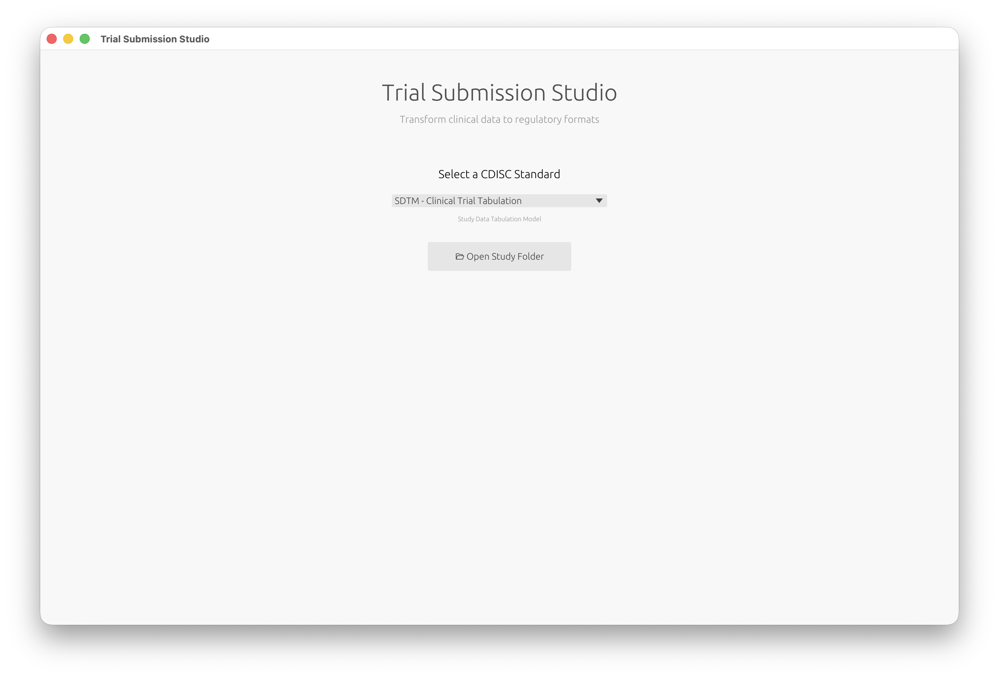
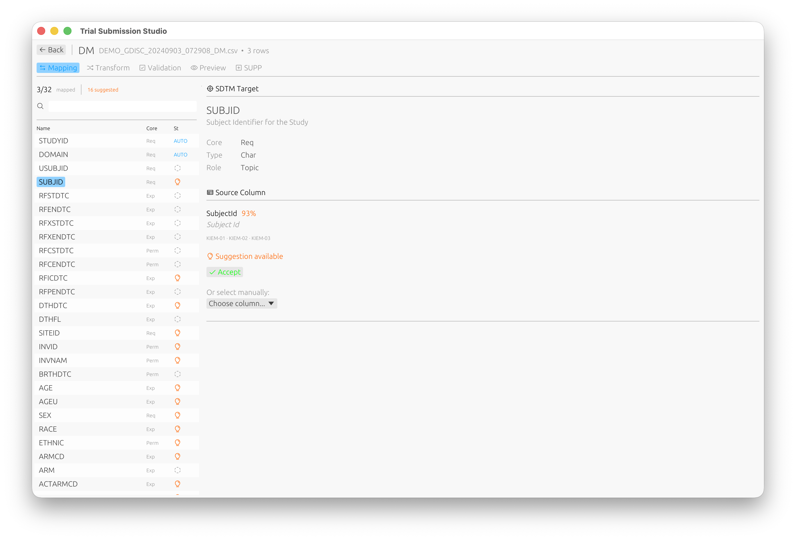

# Welcome to Trial Submission Studio

  

**Transform clinical trial data into FDA-compliant CDISC formats with
confidence.**

Trial Submission Studio is a free, open-source desktop application for
transforming clinical trial source data (CSV) into CDISC-compliant submission
formats.

> [!CAUTION]
> **ALPHA SOFTWARE - ACTIVE DEVELOPMENT**
>
> Trial Submission Studio is currently in early development. Features are
> incomplete, APIs may change, and bugs are expected. **Do not use for production regulatory submissions.**
>
> Always validate all outputs with qualified regulatory professionals before
> submission to regulatory authorities.

---

## See It in Action

**Select your CDISC standard and open your study data:**

**Automatic domain discovery with intelligent column mapping:**

**Built-in validation against CDISC standards:**

---

## Quick Links

| New Users                                                     | Clinical Programmers                           | Developers                                             |
|---------------------------------------------------------------|------------------------------------------------|--------------------------------------------------------|
| [Installation](getting-started/installation.md)               | [User Guide](user-guide/ui-overview.md)        | [Architecture](architecture/overview.md)               |
| [Quick Start](getting-started/quick-start.md)                 | [CDISC Standards](cdisc-standards/overview.md) | [Contributing](contributing/getting-started.md)        |
| [System Requirements](getting-started/system-requirements.md) | [Output Formats](output-formats/xpt-format.md) | [Development Setup](contributing/development-setup.md) |

---

## Key Features

| Feature                 | Description                                             |
|-------------------------|---------------------------------------------------------|
| **Multi-format Output** | XPT V5/V8, Dataset-XML, Define-XML 2.1                  |
| **Intelligent Mapping** | Fuzzy matching for automatic column-to-variable mapping |
| **CDISC Validation**    | Built-in controlled terminology validation              |
| **Cross-platform**      | Native GUI for macOS, Windows, and Linux                |
| **Offline Operation**   | All CDISC standards embedded locally                    |

---

## Supported Standards

**Currently Supported:**

- SDTM-IG v3.4
- Controlled Terminology (2024-2025 versions)

**Planned:**

- ADaM-IG v1.3
- SEND-IG v3.1.1

---

## Getting Help

- **Documentation**: You're reading it! Use the sidebar to navigate.
- **Issues**:
  [Report bugs on GitHub](https://github.com/rubentalstra/Trial-Submission-Studio/issues)
- **Discussions**:
  [Ask questions on GitHub Discussions](https://github.com/rubentalstra/Trial-Submission-Studio/discussions)

---

## License

Trial Submission Studio is open source software licensed under the
[MIT License](https://github.com/rubentalstra/Trial-Submission-Studio/blob/main/LICENSE).

---

  Built with Rust and Iced

