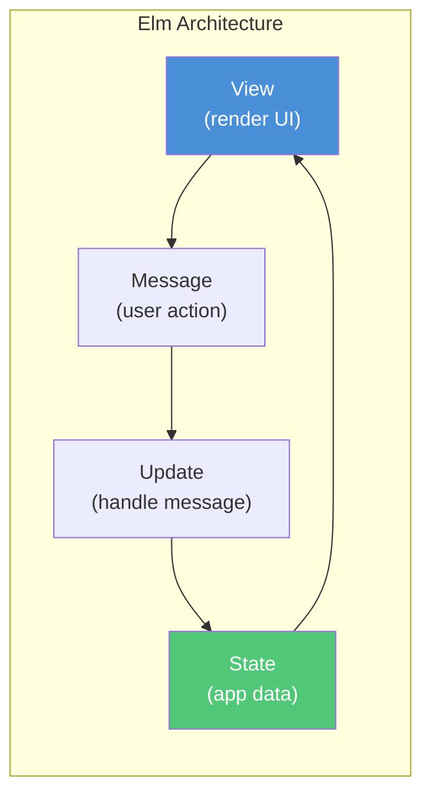
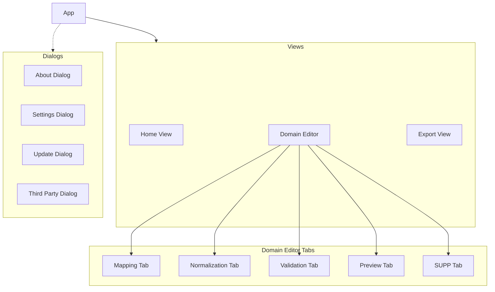
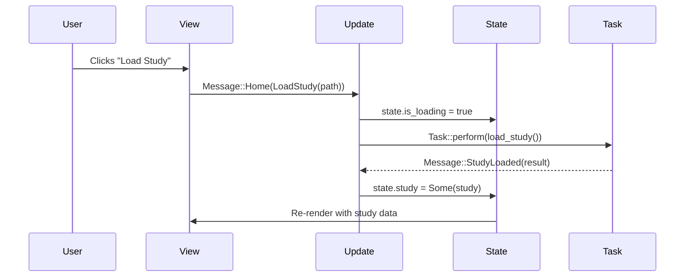

# tss-gui

The desktop application crate providing the graphical user interface using Iced 0.14.0.

## Overview

`tss-gui` is the main entry point for Trial Submission Studio, built with the Iced GUI framework following the Elm architecture pattern. It provides a clinical-style desktop interface for transforming clinical trial data into FDA-compliant formats.

## Responsibilities

- Application window and layout
- User interaction handling via message passing
- Navigation between workflow steps
- Data visualization
- File dialogs and system integration
- Multi-window dialog management

## Dependencies

```toml
[dependencies]
# Iced GUI framework (Elm architecture)
iced = { version = "0.14.0", features = [
    "tokio",     # Async runtime for Task::perform
    "image",     # Image loading (PNG icons)
    "svg",       # SVG rendering for icons
    "markdown",  # Markdown widget (changelogs)
    "lazy",      # Lazy widget rendering
    "advanced",  # Advanced widget capabilities
] }
iced_fonts = { version = "0.3.0", features = ["lucide"] }

# File dialogs
rfd = "0.17"

# System integration
directories = "6.0"
open = "5.3"

# Path dependencies
tss-ingest = { path = "../tss-ingest" }
tss-standards = { path = "../tss-standards" }
tss-submit = { path = "../tss-submit" }
tss-updater = { path = "../tss-updater" }
```

## Architecture

### Elm Architecture Pattern

Trial Submission Studio follows Iced's Elm architecture:



Key principles:
- **State is the single source of truth**
- **All state changes happen through messages in `update()`**
- **Views are pure functions of state**
- **Async operations use `Task`, not channels**

### Module Structure

```
tss-gui/
├── src/
│   ├── main.rs              # Entry point
│   ├── lib.rs               # Library root
│   ├── app/
│   │   ├── mod.rs           # App struct with new(), update(), view()
│   │   └── handler/         # Message handlers by category
│   ├── state/
│   │   ├── mod.rs           # AppState root container
│   │   ├── view_state.rs    # ViewState, EditorTab, filters
│   │   ├── study.rs         # Study data structure
│   │   ├── domain_state.rs  # DomainState, mappings, SUPP
│   │   └── settings.rs      # User preferences (persisted)
│   ├── message/
│   │   ├── mod.rs           # Root Message enum
│   │   ├── home.rs          # HomeMessage
│   │   ├── domain_editor.rs # DomainEditorMessage
│   │   ├── dialog.rs        # DialogMessage (About, Settings, etc.)
│   │   ├── export.rs        # ExportMessage
│   │   └── menu.rs          # MenuMessage
│   ├── view/
│   │   ├── mod.rs           # View router
│   │   ├── home/            # Home/welcome screen views
│   │   ├── domain_editor/   # Domain editor tabs (mapping, validation, etc.)
│   │   ├── dialog/          # Dialog windows (about, settings, update)
│   │   └── export.rs        # Export view
│   ├── component/
│   │   ├── mod.rs           # Reusable UI components
│   │   ├── data_grid.rs     # Virtual scrolling data table
│   │   ├── toast.rs         # Toast notifications
│   │   └── ...
│   ├── theme/
│   │   ├── mod.rs           # Clinical-style theming
│   │   ├── colors.rs        # Color palette
│   │   └── styles.rs        # Widget styles
│   ├── menu/
│   │   ├── mod.rs           # Menu system
│   │   ├── macos/           # Native macOS menu (muda)
│   │   └── desktop/         # In-app menu (Windows/Linux)
│   └── service/
│       └── ...              # Background services
└── assets/
    ├── icon.svg
    └── icon.png
```

### Application Entry Point

The application uses Iced 0.14.0's builder pattern:

```rust
fn main() -> iced::Result {
    iced::application(App::new, App::update, App::view)
        .title(App::title)
        .theme(App::theme)
        .subscription(App::subscription)
        .settings(settings)
        .run_with(|| App::init())
}
```

## State Management

### Root State

```rust
pub struct AppState {
    /// Current view and its associated UI state
    pub view: ViewState,

    /// Loaded study data (None when no study is open)
    pub study: Option<Study>,

    /// User settings (persisted to disk)
    pub settings: Settings,

    /// CDISC Controlled Terminology registry
    pub terminology: Option<TerminologyRegistry>,

    /// Current error message to display (transient)
    pub error: Option<String>,

    /// Whether a background task is running
    pub is_loading: bool,

    /// Tracks open dialog windows
    pub dialog_windows: DialogWindows,

    /// Active toast notification
    pub toast: Option<ToastState>,
}
```

### View State

```rust
pub enum ViewState {
    /// Home/welcome screen
    Home { /* pagination, filters */ },

    /// Domain editor with tabs
    DomainEditor {
        domain: String,
        tab: EditorTab,
        mapping_ui: MappingUiState,
        normalization_ui: NormalizationUiState,
        validation_ui: ValidationUiState,
        preview_ui: PreviewUiState,
        supp_ui: SuppUiState,
    },

    /// Export view
    Export(ExportViewState),
}

pub enum EditorTab {
    Mapping,
    Normalization,
    Validation,
    Preview,
    Supp,
}
```

### View Hierarchy



## Message System

### Hierarchical Messages

```rust
pub enum Message {
    // Navigation
    Navigate(ViewState),
    SetWorkflowMode(WorkflowMode),

    // View-specific messages
    Home(HomeMessage),
    DomainEditor(DomainEditorMessage),
    Export(ExportMessage),

    // Dialogs
    Dialog(DialogMessage),

    // Menu
    MenuAction(MenuAction),

    // Background task results
    StudyLoaded(Result<(Study, TerminologyRegistry), String>),
    PreviewReady { domain: String, result: Result<DataFrame, String> },
    ValidationComplete { domain: String, report: ValidationReport },
    UpdateCheckComplete(Result<Option<UpdateInfo>, String>),

    // Global events
    KeyPressed(Key, Modifiers),
    FolderSelected(Option<PathBuf>),
    Toast(ToastMessage),
}
```

### Message Flow Example



## Key Components

### Data Grid

Custom virtual-scrolling widget for large datasets:

```rust
// Features:
// - Virtual scrolling for performance
// - Column sorting
// - Row selection
// - Type-aware formatting (dates, numbers)
// - Alternating row colors
```

### Toast Notifications

Non-blocking notifications for user feedback:

```rust
pub struct ToastState {
    pub message: String,
    pub level: ToastLevel,  // Success, Info, Warning, Error
    pub progress: Option<f32>,
}
```

### Multi-Window Dialogs

Dialogs open as separate windows (Iced multi-window support):

```rust
pub struct DialogWindows {
    pub about: Option<window::Id>,
    pub settings: Option<(window::Id, SettingsCategory)>,
    pub update: Option<(window::Id, UpdateState)>,
    pub third_party: Option<(window::Id, ThirdPartyState)>,
    pub export_progress: Option<(window::Id, ExportProgressState)>,
}
```

## Configuration

### Settings Storage

User preferences stored in:

- macOS: `~/Library/Application Support/Trial Submission Studio/`
- Windows: `%APPDATA%\Trial Submission Studio\`
- Linux: `~/.config/trial-submission-studio/`

### Configurable Options

```rust
pub struct Settings {
    pub recent_studies: Vec<RecentStudy>,
    pub default_export_dir: Option<PathBuf>,
    pub workflow_type: WorkflowType,
    pub sdtm_ig_version: SdtmIgVersion,
    pub xpt_version: XptVersion,
    pub export_format: ExportFormat,
    // Display settings, validation settings, etc.
}
```

## Platform-Specific Features

### macOS

- Native menu bar via `muda` crate
- Sparkle-style updates via `tss-updater-helper`
- App bundle support

### Windows/Linux

- In-app menu bar
- Standard installer/package updates

## Running

```bash
# Development
cargo run --package tss-gui

# Release
cargo run --release --package tss-gui
```

## Testing

```bash
cargo test --package tss-gui
```

Testing focuses on:

- State transitions
- Message handling
- Data transformations
- Integration with other crates

## See Also

- [Architecture Overview](../overview.md) - System architecture
- [tss-submit](tss-submit.md) - Core pipeline
- [Design Decisions](../design-decisions.md) - Why Iced?
- [Interface Overview](../../user-guide/ui-overview.md) - User guide
