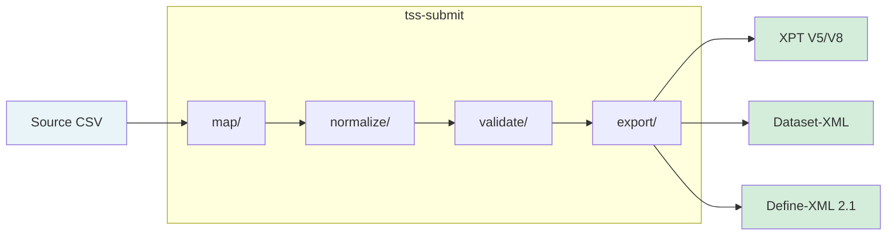
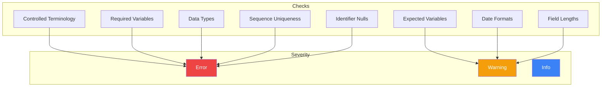

# tss-submit

Core submission preparation crate with mapping, normalization, validation, and export.

## Overview

`tss-submit` is the central processing crate that implements the complete 4-stage pipeline for transforming source data into FDA-compliant CDISC formats. It consolidates all data transformation logic into a single, cohesive module structure.

## Architecture

### Module Structure

```
tss-submit/
├── src/
│   ├── lib.rs              # Crate root, re-exports
│   ├── map/                # Column-to-variable mapping
│   │   ├── mod.rs
│   │   ├── error.rs        # Mapping errors
│   │   ├── score.rs        # Fuzzy scoring engine
│   │   └── state.rs        # Mapping state management
│   ├── normalize/          # Data transformation
│   │   ├── mod.rs
│   │   ├── error.rs        # Normalization errors
│   │   ├── types.rs        # Rule definitions
│   │   ├── inference.rs    # Rule inference from metadata
│   │   ├── executor.rs     # Pipeline execution
│   │   ├── preview.rs      # Preview dataframe building
│   │   └── normalization/  # Transform implementations
│   │       ├── ct.rs       # Controlled terminology
│   │       ├── datetime.rs # ISO 8601 dates
│   │       ├── duration.rs # ISO 8601 durations
│   │       ├── numeric.rs  # Numeric formatting
│   │       └── studyday.rs # Study day calculation
│   ├── validate/           # CDISC conformance
│   │   ├── mod.rs
│   │   ├── issue.rs        # Issue types and severity
│   │   ├── report.rs       # Validation report
│   │   ├── util.rs         # Helper utilities
│   │   ├── rules/          # Rule categories
│   │   └── checks/         # Validation checks
│   │       ├── ct.rs       # Controlled terminology
│   │       ├── required.rs # Required variables
│   │       ├── expected.rs # Expected variables
│   │       ├── datatype.rs # Data types
│   │       ├── dates.rs    # Date formats
│   │       ├── sequence.rs # Sequence uniqueness
│   │       ├── length.rs   # Field lengths
│   │       └── identifier.rs # Identifier nulls
│   └── export/             # Output generation
│       ├── mod.rs
│       ├── common.rs       # Shared utilities
│       ├── types.rs        # Domain frame types
│       ├── xpt.rs          # XPT V5/V8 format
│       ├── dataset_xml.rs  # Dataset-XML format
│       └── define_xml.rs   # Define-XML 2.1
```

### Pipeline Flow



## Dependencies

```toml
[dependencies]
anyhow = "1"
chrono = "0.4"
polars = { version = "0.46", features = ["lazy", "csv"] }
quick-xml = "0.37"
rapidfuzz = "0.5"
regex = "1.12"
serde = { version = "1", features = ["derive"] }
thiserror = "2"
tracing = "0.1"
xportrs = "0.3"

tss-standards = { path = "../tss-standards" }
```

## Module: map/

Fuzzy column-to-variable mapping with confidence scoring.

### Design Philosophy

- **Simple**: Pure Jaro-Winkler scoring with minimal adjustments
- **Explainable**: Score breakdowns show why a match scored as it did
- **Session-only**: No persistence, mappings live for the session duration
- **Centralized**: GUI calls this module for scoring instead of reimplementing

### Key Types

```rust
pub enum VariableStatus {
    Unmapped,      // No suggestion or mapping
    Suggested,     // Auto-suggestion available
    Accepted,      // User accepted a mapping
}

pub struct ColumnScore {
    pub column: String,
    pub score: f64,
    pub components: Vec<ScoreComponent>,
}

pub struct MappingState {
    // Manages all mappings for a domain session
}
```

### API Usage

```rust
use tss_submit::map::{MappingState, VariableStatus};

// Create mapping state with auto-suggestions
let mut state = MappingState::new(domain, "STUDY01", &columns, hints, 0.6);

// Check and accept mappings
match state.status("USUBJID") {
    VariableStatus::Suggested => {
        state.accept_suggestion("USUBJID").unwrap();
    }
    VariableStatus::Unmapped => {
        state.accept_manual("USUBJID", "SUBJECT_ID").unwrap();
    }
    _ => {}
}

// Get all scores for dropdown sorting
let scores = state.scorer().score_all_for_variable("AETERM", &available_cols);
```

## Module: normalize/

Data-driven, variable-level normalization for SDTM compliance.

### Design Principles

- **Metadata-driven**: All normalization types inferred from Variable metadata
- **SDTM-compliant**: Follows SDTMIG v3.4 rules for dates, CT, sequences
- **Stateless functions**: Pure functions for easy testing and composition
- **Error preservation**: On normalization failure, preserve original value + log

### Normalization Types

| Type | Description | Example |
|------|-------------|---------|
| `DateTime` | ISO 8601 datetime | `2024-01-15` → `2024-01-15T00:00:00` |
| `ControlledTerminology` | CT codelist mapping | `male` → `M` |
| `Duration` | ISO 8601 duration | `2 weeks` → `P14D` |
| `StudyDay` | Calculate --DY | Reference date to study day |
| `Numeric` | Numeric formatting | Precision and rounding |

### API Usage

```rust
use tss_submit::normalize::{
    infer_normalization_rules,
    execute_normalization,
    NormalizationContext
};

// Infer rules from SDTM metadata
let pipeline = infer_normalization_rules(&domain);

// Create execution context
let context = NormalizationContext::new("CDISC01", "AE")
    .with_mappings(mappings);

// Execute normalizations
let result_df = execute_normalization(&source_df, &pipeline, &context)?;
```

## Module: validate/

Comprehensive CDISC conformance checking.

### Validation Checks



| Check | Description | Severity |
|-------|-------------|----------|
| Controlled Terminology | Values match CT codelists | Error |
| Required Variables | Req variables present and populated | Error |
| Expected Variables | Exp variables present | Warning |
| Data Types | Num columns contain numeric data | Error |
| Date Formats | ISO 8601 compliance | Warning |
| Sequence Uniqueness | --SEQ unique per USUBJID | Error |
| Field Lengths | Character field limits | Warning |
| Identifier Nulls | ID variables have no nulls | Error |

### API Usage

```rust
use tss_submit::validate::{validate_domain, Issue, Severity};

// Validate a domain
let report = validate_domain(&domain, &df, ct_registry.as_ref());

// Process issues
for issue in &report.issues {
    match issue.severity() {
        Severity::Error => eprintln!("ERROR: {}", issue.message()),
        Severity::Warning => eprintln!("WARN: {}", issue.message()),
        Severity::Info => println!("INFO: {}", issue.message()),
    }
}

// Check if exportable
if report.has_errors() {
    println!("Cannot export: {} errors found", report.error_count());
}
```

## Module: export/

Multi-format output generation for FDA submissions.

### Supported Formats

| Format | Description | Use Case |
|--------|-------------|----------|
| **XPT V5/V8** | SAS Transport format | Primary FDA submission |
| **Dataset-XML** | CDISC Dataset-XML | Data exchange |
| **Define-XML 2.1** | Metadata documentation | Submission documentation |

### API Usage

```rust
use tss_submit::export::{
    write_xpt_outputs,
    write_dataset_xml_outputs,
    write_define_xml,
    DomainFrame,
};

// Prepare domain data
let domains: Vec<DomainFrame> = vec![
    DomainFrame::new("DM", dm_df),
    DomainFrame::new("AE", ae_df),
];

// Export to XPT
write_xpt_outputs(&domains, output_dir)?;

// Export to Dataset-XML
let xml_options = DatasetXmlOptions::default();
write_dataset_xml_outputs(&domains, output_dir, &xml_options)?;

// Export Define-XML
let define_options = DefineXmlOptions::new("STUDY01", "1.0");
write_define_xml(&domains, &define_options, output_path)?;
```

## Error Handling

Each module has dedicated error types:

```rust
// Mapping errors
pub enum MappingError {
    VariableNotFound(String),
    ColumnNotFound(String),
    AlreadyMapped(String),
}

// Normalization errors
pub enum NormalizationError {
    InvalidDate(String),
    InvalidCodelist(String, String),
    MissingContext(String),
}

// Validation uses Issue + Severity (not errors)
```

## Testing

```bash
# Run all tss-submit tests
cargo test --package tss-submit

# Run specific module tests
cargo test --package tss-submit map::
cargo test --package tss-submit normalize::
cargo test --package tss-submit validate::
cargo test --package tss-submit export::
```

## See Also

- [Architecture Overview](../overview.md) - System architecture
- [Column Mapping](../../user-guide/column-mapping.md) - User guide
- [Validation](../../user-guide/validation.md) - User guide
- [Exporting Data](../../user-guide/exporting-data.md) - User guide
- [tss-standards](tss-standards.md) - Standards loader
