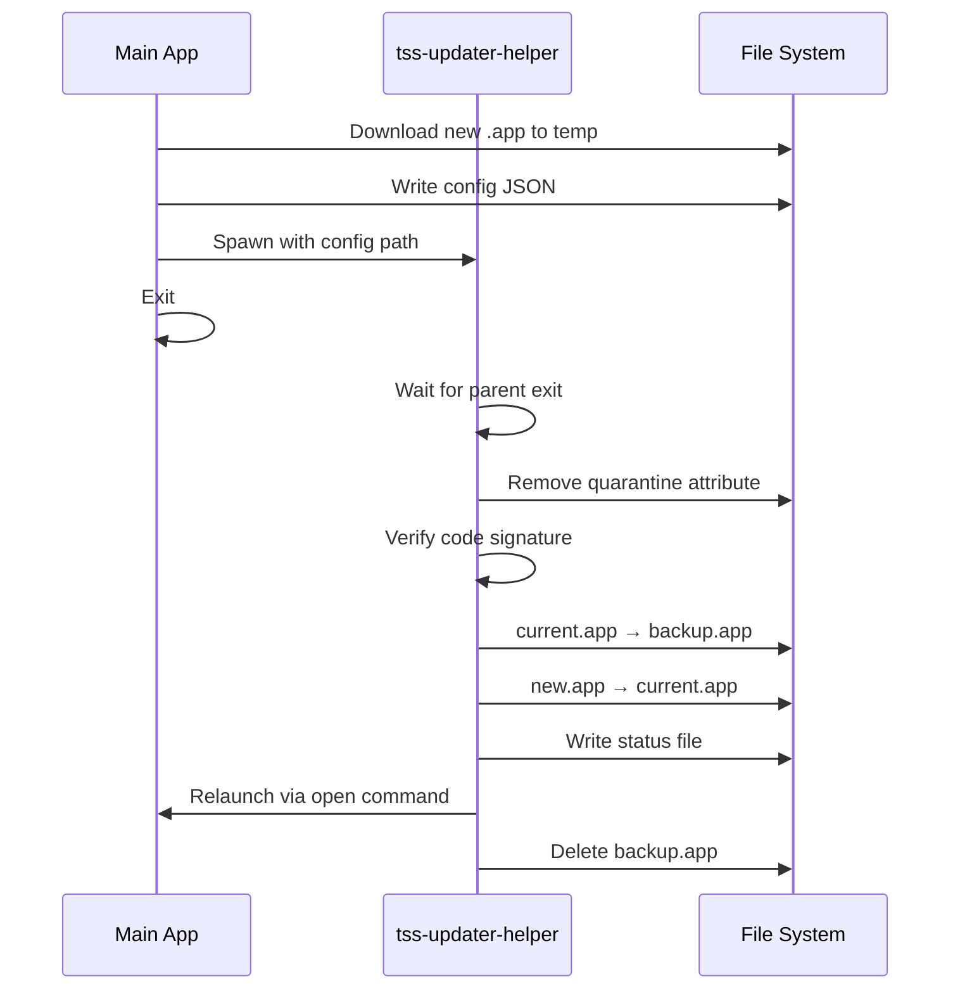

# tss-updater-helper

macOS update helper binary for app bundle swapping.

## Overview

`tss-updater-helper` is a minimal helper binary that performs the actual app bundle swap during updates on macOS. It is spawned by the main application after downloading an update, allowing the main app to exit while the update is applied.

This crate is **macOS-only** - on other platforms, it compiles to a no-op binary that exits immediately.

## Why a Separate Binary?

On macOS, applications are distributed as `.app` bundles (directories). The main application cannot replace itself while running because:

1. The executable is locked by the OS while running
2. Bundle contents may be memory-mapped
3. Code signing requires atomic bundle replacement

The helper binary solves this by:
- Running as a separate process
- Waiting for the parent app to exit
- Performing the swap atomically
- Relaunching the updated app

## Architecture

### Module Structure

```
tss-updater-helper/
├── src/
│   ├── main.rs          # Entry point, orchestration
│   ├── config.rs        # JSON config parsing
│   ├── launch.rs        # Parent wait, app relaunch
│   ├── log.rs           # File-based logging
│   ├── quarantine.rs    # Remove macOS quarantine
│   ├── signature.rs     # Code signature verification
│   ├── status.rs        # Status file for feedback
│   └── swap.rs          # Atomic bundle swap
```

### Update Flow



## Dependencies

```toml
[target.'cfg(target_os = "macos")'.dependencies]
chrono = "0.4"
serde = { version = "1", features = ["derive"] }
serde_json = "1"
```

The crate has no dependencies on non-macOS platforms.

## Configuration

The helper receives configuration via a JSON file (not stdin, to avoid race conditions):

```rust
pub struct HelperConfig {
    pub new_app_path: PathBuf,      // Path to downloaded .app
    pub current_app_path: PathBuf,   // Path to current .app
    pub parent_pid: u32,             // PID to wait for
    pub version: String,             // New version string
    pub previous_version: String,    // Current version string
}
```

Example config file:
```json
{
  "new_app_path": "/tmp/TSS-update/Trial Submission Studio.app",
  "current_app_path": "/Applications/Trial Submission Studio.app",
  "parent_pid": 12345,
  "version": "0.1.0",
  "previous_version": "0.0.9"
}
```

## Process Steps

### 1. Wait for Parent Exit

```rust
pub fn wait_for_parent(pid: u32) {
    // Poll until process no longer exists
    while process_exists(pid) {
        std::thread::sleep(Duration::from_millis(100));
    }
}
```

### 2. Remove Quarantine

Downloaded files on macOS have a quarantine attribute that triggers Gatekeeper. The helper removes this:

```rust
pub fn remove_quarantine(path: &Path) -> Result<()> {
    Command::new("xattr")
        .args(["-rd", "com.apple.quarantine"])
        .arg(path)
        .output()?;
    Ok(())
}
```

### 3. Verify Code Signature

Before replacing the current app, verify the new bundle is properly signed:

```rust
pub fn verify_signature(path: &Path) -> Result<()> {
    let output = Command::new("codesign")
        .args(["--verify", "--deep", "--strict"])
        .arg(path)
        .output()?;

    if !output.status.success() {
        return Err(anyhow!("Code signature verification failed"));
    }
    Ok(())
}
```

### 4. Atomic Bundle Swap

The swap is performed atomically to prevent corruption:

```rust
pub fn swap_bundles(new: &Path, current: &Path) -> Result<SwapResult> {
    let backup = current.with_extension("app.backup");

    // Move current → backup
    fs::rename(current, &backup)?;

    // Move new → current
    fs::rename(new, current)?;

    Ok(SwapResult { backup_path: backup })
}
```

### 5. Status File

A status file is written for the relaunched app to display feedback:

```rust
pub struct UpdateStatus {
    pub success: bool,
    pub version: String,
    pub previous_version: String,
    pub error: Option<String>,
    pub log_path: PathBuf,
    pub timestamp: DateTime<Utc>,
}
```

Location: `~/Library/Application Support/Trial Submission Studio/update-status.json`

### 6. Relaunch

The app is relaunched using macOS `open` command:

```rust
pub fn relaunch(app_path: &Path) -> Result<()> {
    Command::new("open")
        .arg("-a")
        .arg(app_path)
        .spawn()?;
    Ok(())
}
```

## Logging

All operations are logged to a file for debugging:

```
~/Library/Logs/Trial Submission Studio/update-helper.log
```

Example log output:
```
[2024-01-15T10:30:00Z] Trial Submission Studio Update Helper started
[2024-01-15T10:30:00Z] Config file: /tmp/tss-update-config.json
[2024-01-15T10:30:00Z] Config loaded: HelperConfig { ... }
[2024-01-15T10:30:00Z] Paths validated
[2024-01-15T10:30:01Z] Parent process 12345 exited
[2024-01-15T10:30:01Z] Quarantine attribute removed
[2024-01-15T10:30:01Z] Code signature valid, Team ID: XXXXXXXXXX
[2024-01-15T10:30:02Z] Bundle swap complete, backup at: /Applications/Trial Submission Studio.app.backup
[2024-01-15T10:30:02Z] Status file written
[2024-01-15T10:30:02Z] Application relaunch command sent
[2024-01-15T10:30:02Z] Update complete!
```

## Error Handling

On failure, the helper:
1. Writes a failure status file with error details
2. Does NOT attempt rollback (backup preserved for manual recovery)
3. Logs the error
4. Exits with non-zero code

The relaunched app reads the status file and displays appropriate feedback.

## Building

```bash
# Build for current platform
cargo build --package tss-updater-helper --release

# The binary is only functional on macOS
# On other platforms, it compiles but exits immediately
```

## Integration with tss-updater

The `tss-updater` crate spawns this helper during the update process:

```rust
// In tss-updater
let config_path = write_config_file(&config)?;

Command::new(helper_path)
    .arg(&config_path)
    .spawn()?;

// Parent app exits here
std::process::exit(0);
```

## Security Considerations

- **Code signing**: New bundles must pass `codesign --verify`
- **Quarantine removal**: Only performed on verified bundles
- **Atomic swap**: Prevents partial/corrupted installations
- **Backup preservation**: Allows manual rollback if needed
- **Logging**: Full audit trail for debugging

## See Also

- [tss-updater](tss-updater.md) - Main update logic
- [Architecture Overview](../overview.md) - System architecture
