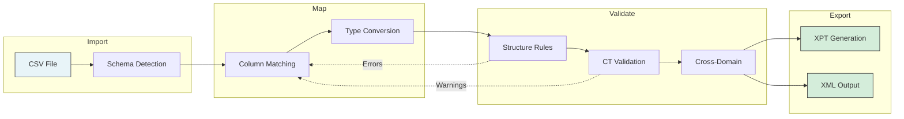
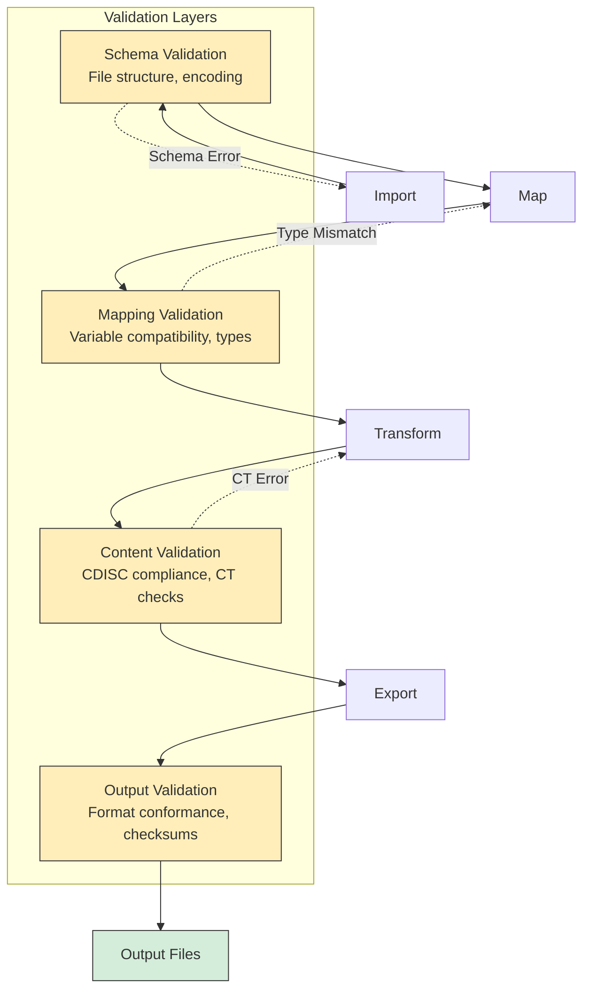

# Design Decisions

Key architectural decisions and their rationale.

## Why Rust?

### Chosen: Rust

**Rationale**:

- **Memory safety** without garbage collection
- **Performance** comparable to C/C++
- **Type system** catches errors at compile time
- **Cross-platform** compilation to native binaries
- **Growing ecosystem** for data processing

### Alternatives Considered

| Language | Pros                     | Cons                         |
|----------|--------------------------|------------------------------|
| Python   | Familiar, many libraries | Performance, distribution    |
| Java     | Cross-platform, mature   | JVM dependency, startup time |
| C++      | Performance              | Memory safety, complexity    |
| Go       | Simple, fast compilation | Less expressive types        |

## Why egui for GUI?

### Chosen: egui/eframe

**Rationale**:

- **Immediate mode** - Simple mental model
- **Pure Rust** - No FFI complexity
- **Cross-platform** - macOS, Windows, Linux
- **Lightweight** - Small binary size
- **Fast iteration** - Easy to prototype

### Alternatives Considered

| Framework | Pros               | Cons                         |
|-----------|--------------------|------------------------------|
| Tauri     | Web tech, flexible | Bundle size, two languages   |
| GTK-rs    | Native look        | Platform differences         |
| Qt        | Mature, rich       | License complexity, bindings |
| Iced      | Elm-like           | Less mature                  |

## Why Polars for Data?

### Chosen: Polars

**Rationale**:

- **Performance** - Lazy evaluation, parallelism
- **Rust native** - No Python dependency
- **DataFrame API** - Familiar for data work
- **Memory efficient** - Arrow-based

### Alternatives Considered

| Library | Pros              | Cons                    |
|---------|-------------------|-------------------------|
| ndarray | Low-level control | More manual work        |
| Arrow   | Standard format   | Less DataFrame features |
| Custom  | Full control      | Development time        |

## Why Embed Standards?

### Chosen: Embedded CDISC data

**Rationale**:

- **Offline operation** - No network dependency
- **Deterministic** - Consistent across runs
- **Fast** - No API latency
- **Regulatory** - Audit trail

### Alternatives Considered

| Approach           | Pros           | Cons                      |
|--------------------|----------------|---------------------------|
| API-based          | Always current | Network required, latency |
| Download on demand | Smaller binary | Caching complexity        |
| Plugin system      | Flexible       | Distribution complexity   |

## Workspace Architecture

### Chosen: Multi-crate workspace

**Rationale**:

- **Separation of concerns** - Clear boundaries
- **Parallel compilation** - Faster builds
- **Selective testing** - Test only changed crates
- **Reusability** - Crates can be used independently

### Crate Boundaries

| Boundary      | Principle                                   |
|---------------|---------------------------------------------|
| tss-model     | Core types, no dependencies on other crates |
| tss-standards | Pure data loading, no transformation logic  |
| tss-validate  | Rules only, no I/O                          |
| xport         | XPT format only, no CDISC logic             |

## Data Processing Pipeline

### Chosen: Lazy evaluation with checkpoints

**Rationale**:

- **Memory efficiency** - Don't load all data at once
- **Performance** - Optimize query plans
- **Transparency** - User sees intermediate results
- **Recoverability** - Can resume from checkpoints

### Pipeline Stages

## Validation Strategy

### Chosen: Multi-level validation

**Rationale**:

- **Early feedback** - Catch issues during mapping
- **Complete checking** - Full validation before export
- **Severity levels** - Error vs. warning vs. info
- **Actionable** - Clear fix suggestions

### Validation Levels

| Level   | When       | Purpose                |
|---------|------------|------------------------|
| Schema  | Import     | File structure         |
| Mapping | Map step   | Variable compatibility |
| Content | Pre-export | CDISC compliance       |
| Output  | Export     | Format conformance     |

## Error Handling

### Chosen: Result types with context

**Rationale**:

- **No panics** - Graceful error handling
- **Context** - Where and why errors occurred
- **Recovery** - Allow user to fix and continue
- **Logging** - Full trace for debugging

### Error Categories

| Category     | Handling                          |
|--------------|-----------------------------------|
| User error   | Display message, allow retry      |
| Data error   | Show affected rows, suggest fix   |
| System error | Log, display generic message      |
| Bug          | Log with context, fail gracefully |

## File Format Choices

### XPT V5 as Default

**Rationale**:

- FDA requirement for submissions
- Maximum compatibility
- Well-documented format

### XPT V8 as Option

**Rationale**:

- Longer variable names
- Larger labels
- Future-proofing

## Security Considerations

### Data Privacy

- **No cloud** - All processing local
- **No telemetry** - No usage data collection
- **No network** - Works fully offline

### Code Security

- **Dependency audit** - Regular `cargo audit`
- **Minimal dependencies** - Reduce attack surface
- **Memory safety** - Rust's guarantees

## Performance Goals

### Target Metrics

| Operation           | Target      |
|---------------------|-------------|
| Import 100K rows    | < 2 seconds |
| Validation          | < 5 seconds |
| Export to XPT       | < 3 seconds |
| Application startup | < 1 second  |

### Optimization Strategies

- Lazy evaluation
- Parallel processing
- Memory mapping for large files
- Incremental validation

## Future Considerations

### Extensibility

The architecture supports future additions:

- New CDISC standards (ADaM, SEND)
- Additional output formats
- Plugin system (potential)
- CLI interface (potential)

### Backward Compatibility

- Configuration format versioning
- Data migration paths
- Deprecation warnings

## Next Steps

- [Architecture Overview](overview.md) - System structure
- [Crate Documentation](crates/tss-gui.md) - Component details
