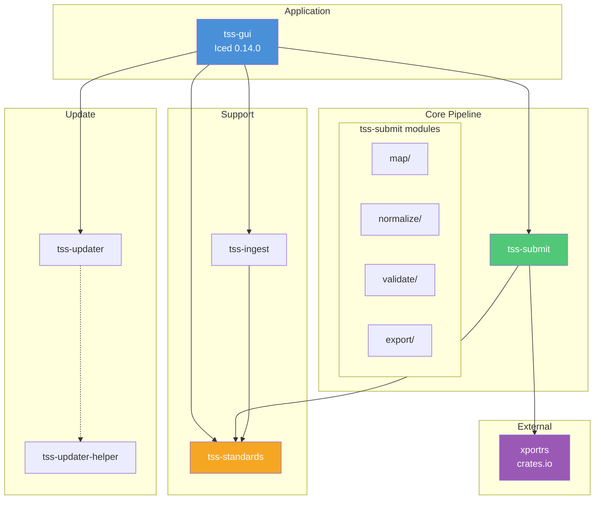
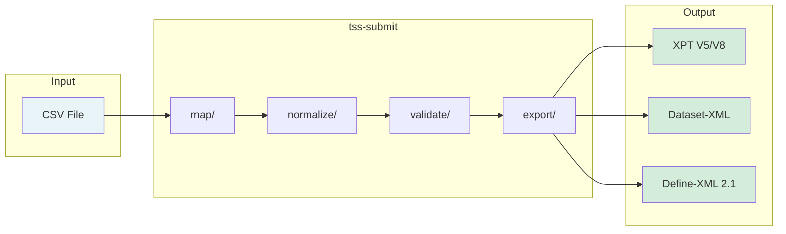
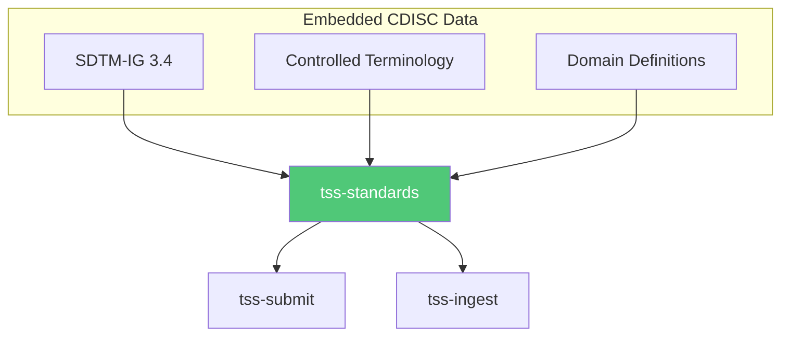
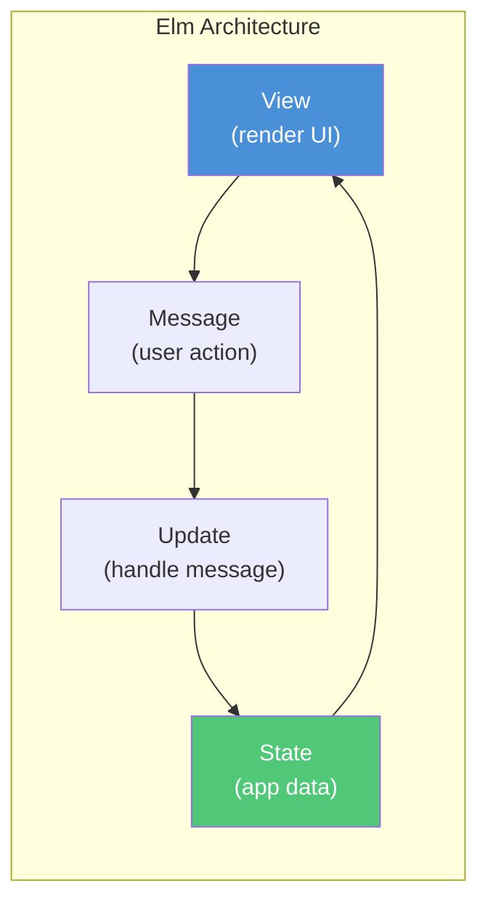

# Architecture Overview

Trial Submission Studio is built as a modular Rust workspace with 6 specialized crates.

## Design Philosophy

### Core Principles

1. **Separation of Concerns** - Each crate has a single responsibility
2. **Deterministic Output** - Reproducible results for regulatory compliance
3. **Offline Operation** - All standards embedded, no network dependencies
4. **Type Safety** - Rust's type system prevents data errors

### Key Design Decisions

- **Pure Functions** - Mapping and validation logic is side-effect free
- **Embedded Standards** - CDISC data bundled in binary
- **No External APIs** - Works without internet connection
- **Auditable** - Clear data lineage and transformations

## Workspace Structure

```
trial-submission-studio/
├── Cargo.toml              # Workspace configuration
├── crates/
│   ├── tss-gui/            # Desktop application (Iced 0.14.0)
│   ├── tss-submit/         # Mapping, normalization, validation, export
│   ├── tss-ingest/         # CSV loading
│   ├── tss-standards/      # CDISC standards loader
│   ├── tss-updater/        # App update mechanism
│   └── tss-updater-helper/ # macOS bundle swap helper
├── standards/              # Embedded CDISC data
├── mockdata/               # Test datasets
└── docs/                   # This documentation
```

## Crate Dependency Graph



## Crate Responsibilities

| Crate | Purpose | Key Dependencies |
|-------|---------|------------------|
| **tss-gui** | Desktop application | Iced 0.14.0 |
| **tss-submit** | Mapping, normalization, validation, export | rapidfuzz, xportrs, quick-xml |
| **tss-ingest** | CSV loading | csv, polars |
| **tss-standards** | CDISC standards loader | serde, serde_json |
| **tss-updater** | App updates | reqwest |
| **tss-updater-helper** | macOS bundle swap | (macOS-only) |

## Data Flow

### Import to Export Pipeline



### Pipeline Stages

| Stage | Module | Purpose |
|-------|--------|---------|
| 1. Map | `tss-submit/map/` | Fuzzy column-to-variable mapping with confidence scoring |
| 2. Normalize | `tss-submit/normalize/` | Data transformation (datetime, CT, studyday, duration) |
| 3. Validate | `tss-submit/validate/` | CDISC conformance checking (CT, required, dates, datatypes) |
| 4. Export | `tss-submit/export/` | Output generation (XPT via xportrs, Dataset-XML, Define-XML) |

### Standards Integration



## Key Technologies

### Core Stack

| Component | Technology |
|-----------|------------|
| Language | Rust 1.92+ |
| GUI Framework | Iced 0.14.0 (Elm architecture) |
| Data Processing | Polars |
| Serialization | Serde |
| Testing | Insta, Proptest |

### External Crates

| Purpose | Crate |
|---------|-------|
| Fuzzy matching | rapidfuzz |
| XML processing | quick-xml |
| XPT handling | xportrs |
| Logging | tracing |
| HTTP client | reqwest |

## GUI Architecture

Trial Submission Studio uses **Iced 0.14.0** with the Elm architecture pattern:



Key GUI components:
- **State types**: `ViewState`, `Study`, `DomainState`, `Settings`
- **Message enums**: `Message` -> `HomeMessage`, `DomainEditorMessage`, `DialogMessage`
- **View functions**: Organized by screen (`home/`, `domain_editor/`, `dialog/`)
- **Theme**: Clinical-style theming with custom color palette

## Embedded Data

### Standards Directory

```
standards/
├── sdtm/
│   └── ig/v3.4/
│       ├── Datasets.csv         # Domain definitions
│       ├── Variables.csv        # Variable metadata
│       ├── metadata.toml        # Version info
│       └── chapters/            # IG chapter documentation
├── adam/
│   └── ig/v1.3/
│       ├── DataStructures.csv   # ADaM structures
│       ├── Variables.csv        # Variable metadata
│       └── metadata.toml
├── send/
│   └── ig/v3.1.1/
│       ├── Datasets.csv         # SEND domains
│       ├── Variables.csv        # Variable metadata
│       └── metadata.toml
├── terminology/
│   ├── 2024-03-29/              # CT release date
│   │   ├── SDTM_CT_*.csv
│   │   ├── SEND_CT_*.csv
│   │   └── ADaM_CT_*.csv
│   ├── 2025-03-28/
│   └── 2025-09-26/              # Latest CT
├── validation/
│   ├── sdtm/Rules.csv           # SDTM validation rules
│   ├── adam/Rules.csv           # ADaM validation rules
│   └── send/Rules.csv           # SEND validation rules
└── xsl/
    ├── define2-0-0.xsl          # Define-XML stylesheets
    └── define2-1.xsl
```

## Testing Strategy

### Test Types

| Type | Purpose | Crates |
|------|---------|--------|
| Unit | Function-level | All |
| Integration | Cross-crate | tss-gui |
| Snapshot | Output stability | tss-submit/export |
| Property | Edge cases | tss-submit/map, tss-submit/validate |

### Test Data

Mock datasets in `mockdata/` for:

- Various domain types
- Edge cases
- Validation testing

## Next Steps

- [Crate Documentation](crates/tss-gui.md) - Individual crate details
- [Design Decisions](design-decisions.md) - Architectural choices
- [Contributing](../contributing/getting-started.md) - Development guide
