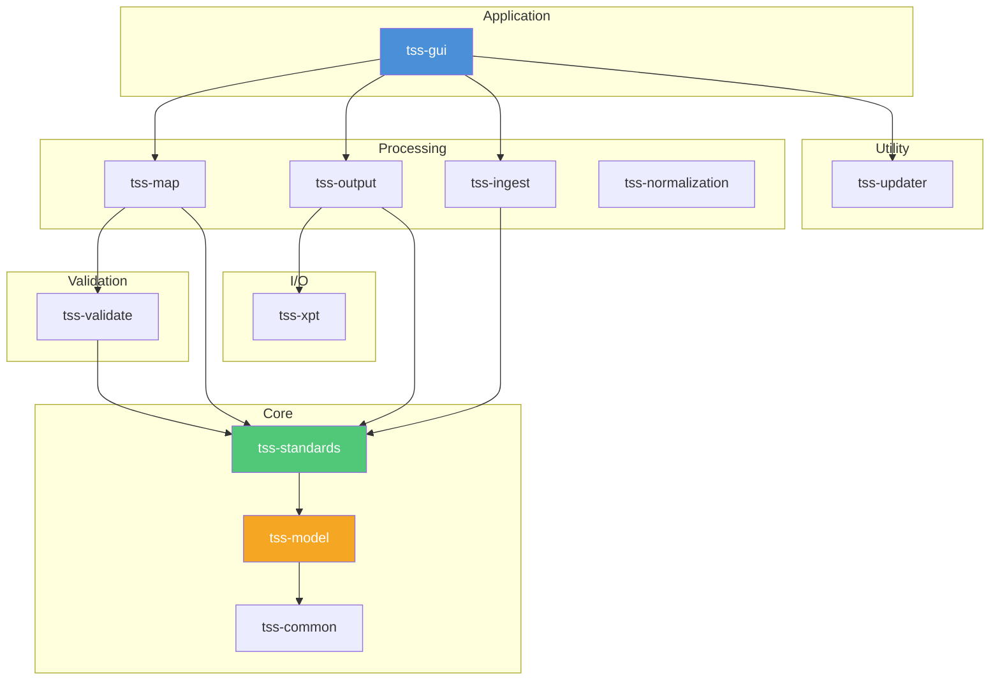
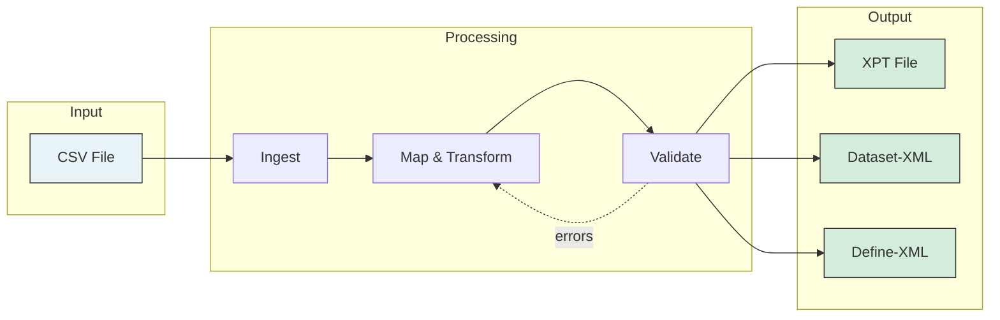
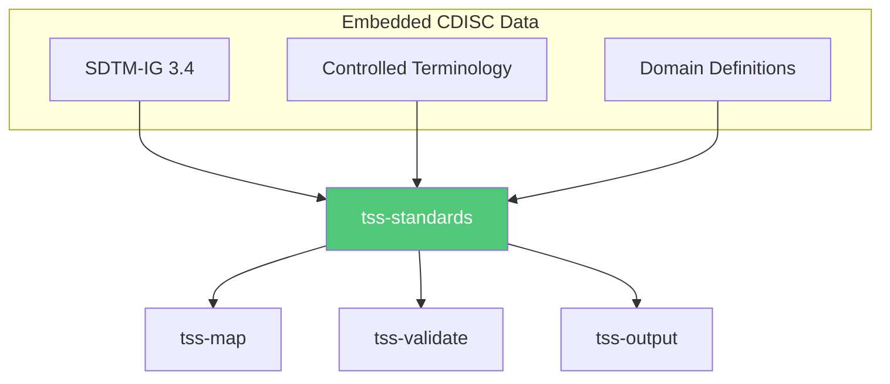

# Architecture Overview

Trial Submission Studio is built as a modular Rust workspace with 11 specialized crates.

## Design Philosophy

### Core Principles

1. **Separation of Concerns** - Each crate has a single responsibility
2. **Deterministic Output** - Reproducible results for regulatory compliance
3. **Offline Operation** - All standards embedded, no network dependencies
4. **Type Safety** - Rust's type system prevents data errors

### Key Design Decisions

- **Pure Functions** - Mapping and validation logic is side-effect free
- **Embedded Standards** - CDISC data bundled in binary
- **No External APIs** - Works without internet connection
- **Auditable** - Clear data lineage and transformations

## Workspace Structure

```
trial-submission-studio/
├── Cargo.toml              # Workspace configuration
├── crates/
│   ├── tss-gui/            # Desktop application
│   ├── tss-xpt/            # XPT file I/O
│   ├── tss-validate/       # CDISC validation
│   ├── tss-map/            # Column mapping
│   ├── tss-normalization/      # Data transformations
│   ├── tss-ingest/         # CSV loading
│   ├── tss-output/         # Multi-format export
│   ├── tss-standards/      # CDISC standards loader
│   ├── tss-model/          # Core types
│   ├── tss-common/         # Shared utilities
│   └── tss-updater/        # App update mechanism
├── standards/              # Embedded CDISC data
├── mockdata/               # Test datasets
└── docs/                   # This documentation
```

## Crate Dependency Graph



## Crate Responsibilities

| Crate             | Purpose                | Key Dependencies       |
|-------------------|------------------------|------------------------|
| **tss-gui**       | Desktop application    | egui, eframe           |
| **tss-xpt**       | XPT file I/O           | byteorder, encoding_rs |
| **tss-validate**  | CDISC validation       | tss-standards          |
| **tss-map**       | Fuzzy column mapping   | rapidfuzz              |
| **tss-normalization** | Data transformations   | polars                 |
| **tss-ingest**    | CSV loading            | csv, polars            |
| **tss-output**    | Multi-format export    | quick-xml              |
| **tss-standards** | CDISC standards loader | serde, serde_json      |
| **tss-model**     | Core domain types      | chrono                 |
| **tss-common**    | Shared utilities       | tracing                |
| **tss-updater**   | App updates            | reqwest                |

## Data Flow

### Import → Transform → Export



### Standards Integration



## Key Technologies

### Core Stack

| Component       | Technology      |
|-----------------|-----------------|
| Language        | Rust 1.92+      |
| GUI Framework   | egui/eframe     |
| Data Processing | Polars          |
| Serialization   | Serde           |
| Testing         | Insta, Proptest |

### External Crates

| Purpose        | Crate            |
|----------------|------------------|
| Fuzzy matching | rapidfuzz        |
| XML processing | quick-xml        |
| XPT handling   | Custom (tss-xpt) |
| Logging        | tracing          |
| HTTP client    | reqwest          |

## Embedded Data

### Standards Directory

```
standards/
├── sdtm/
│   └── ig/v3.4/
│       ├── Datasets.csv         # Domain definitions
│       ├── Variables.csv        # Variable metadata
│       ├── metadata.toml        # Version info
│       └── chapters/            # IG chapter documentation
├── adam/
│   └── ig/v1.3/
│       ├── DataStructures.csv   # ADaM structures
│       ├── Variables.csv        # Variable metadata
│       └── metadata.toml
├── send/
│   └── ig/v3.1.1/
│       ├── Datasets.csv         # SEND domains
│       ├── Variables.csv        # Variable metadata
│       └── metadata.toml
├── terminology/
│   ├── 2024-03-29/              # CT release date
│   │   ├── SDTM_CT_*.csv
│   │   ├── SEND_CT_*.csv
│   │   └── ADaM_CT_*.csv
│   ├── 2025-03-28/
│   └── 2025-09-26/              # Latest CT
├── validation/
│   ├── sdtm/Rules.csv           # SDTM validation rules
│   ├── adam/Rules.csv           # ADaM validation rules
│   └── send/Rules.csv           # SEND validation rules
└── xsl/
    ├── define2-0-0.xsl          # Define-XML stylesheets
    └── define2-1.xsl
```

## Testing Strategy

### Test Types

| Type        | Purpose          | Crates                |
|-------------|------------------|-----------------------|
| Unit        | Function-level   | All                   |
| Integration | Cross-crate      | tss-gui               |
| Snapshot    | Output stability | tss-xpt, tss-output   |
| Property    | Edge cases       | tss-map, tss-validate |

### Test Data

Mock datasets in `mockdata/` for:

- Various domain types
- Edge cases
- Validation testing

## Next Steps

- [Crate Documentation](crates/tss-gui.md) - Individual crate details
- [Design Decisions](design-decisions.md) - Architectural choices
- [Contributing](../contributing/getting-started.md) - Development guide
