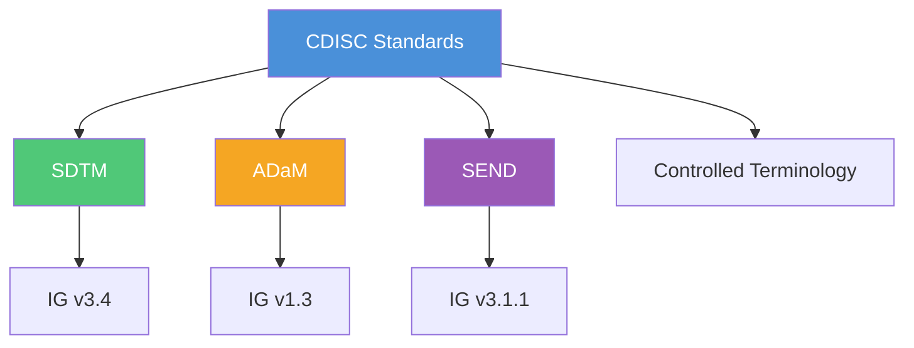

# CDISC Standards Overview

Trial Submission Studio supports CDISC (Clinical Data Interchange Standards
Consortium) standards for regulatory submissions.

## What is CDISC?

CDISC develops global data standards that streamline clinical research and
enable connections to healthcare. These standards are required by regulatory
agencies including the FDA and PMDA.

## Standards Hierarchy

## Supported Standards

### Currently Implemented

| Standard                   | Version   | Status    |
|----------------------------|-----------|-----------|
| **SDTM-IG**                | 3.4       | Supported |
| **Controlled Terminology** | 2024-2025 | Supported |

### Planned Support

| Standard    | Version | Status  |
|-------------|---------|---------|
| **ADaM-IG** | 1.3     | Planned |
| **SEND-IG** | 3.1.1   | Planned |

## SDTM (Study Data Tabulation Model)

SDTM is the standard structure for submitting study data to regulatory
authorities.

### Key Concepts

- **Domains**: Logical groupings of data (e.g., Demographics, Adverse Events)
- **Variables**: Individual data elements within domains
- **Controlled Terminology**: Standardized values for specific variables

### Learn More

- [SDTM Introduction](sdtm/introduction.md)
- [SDTM Domains](sdtm/domains.md)
- [SDTM Variables](sdtm/variables.md)
- [Validation Rules](sdtm/validation-rules.md)

## Controlled Terminology

CDISC Controlled Terminology (CT) provides standardized values for SDTM
variables.

### Embedded Versions

Trial Submission Studio includes the following CT packages:

- CDISC CT 2025-09-26 (latest)
- CDISC CT 2025-03-28
- CDISC CT 2024-03-29

### Learn More

- [Controlled Terminology](controlled-terminology.md)

## ADaM (Analysis Data Model)

ADaM is the standard for analysis-ready datasets derived from SDTM.

> [!NOTE]
> ADaM support is planned for a future release.

- [ADaM Preview](adam-preview.md)

## SEND (Standard for Exchange of Nonclinical Data)

SEND is SDTM for nonclinical (animal) studies.

> [!NOTE]
> SEND support is planned for a future release.

- [SEND Preview](send-preview.md)

## FDA Requirements

### Electronic Submissions

The FDA requires CDISC standards for:

- New Drug Applications (NDA)
- Biologics License Applications (BLA)
- Abbreviated New Drug Applications (ANDA)

### Study Data Technical Conformance Guide

Trial Submission Studio aligns with FDA's Study Data Technical Conformance Guide
requirements:

- XPT V5 format
- Define-XML 2.1
- Controlled Terminology validation

## Resources

### Official CDISC Resources

- [CDISC Website](https://www.cdisc.org/)
- [CDISC Library](https://library.cdisc.org/)
- [CDISC Wiki](https://wiki.cdisc.org/)

### FDA Resources

- [FDA Study Data Standards](https://www.fda.gov/industry/fda-data-standards-advisory-board/study-data-standards-resources)
- [Study Data Technical Conformance Guide](https://www.fda.gov/regulatory-information/search-fda-guidance-documents/study-data-technical-conformance-guide-technical-specifications-document)

## Next Steps

- [SDTM Introduction](sdtm/introduction.md) - Dive into SDTM
- [Controlled Terminology](controlled-terminology.md) - CT reference
