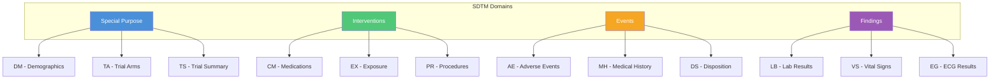

# SDTM Domains

SDTM organizes clinical trial data into domains based on the type of observation.

## Domain Classification

## Domain Categories

### Special Purpose Domains

Core structural domains required for all submissions.

| Domain | Name                      | Description                     |
|--------|---------------------------|---------------------------------|
| **DM** | Demographics              | Subject demographic information |
| **CO** | Comments                  | Free-text comments              |
| **SE** | Subject Elements          | Subject milestones              |
| **SV** | Subject Visits            | Visits for each subject         |
| **TA** | Trial Arms                | Planned study arms              |
| **TD** | Trial Disease             | Disease descriptions            |
| **TE** | Trial Elements            | Planned protocol elements       |
| **TI** | Trial Inclusion/Exclusion | Eligibility criteria            |
| **TS** | Trial Summary             | Study-level parameters          |
| **TV** | Trial Visits              | Planned visits                  |

### Interventions Domains

Treatments and substances given to or used by subjects.

| Domain | Name                    | Description                |
|--------|-------------------------|----------------------------|
| **CM** | Concomitant Medications | Non-study medications      |
| **EC** | Exposure as Collected   | Exposure data as collected |
| **EX** | Exposure                | Study treatment exposure   |
| **PR** | Procedures              | Non-study procedures       |
| **SU** | Substance Use           | Tobacco, alcohol, etc.     |

### Events Domains

Discrete occurrences during study participation.

| Domain | Name                  | Description                  |
|--------|-----------------------|------------------------------|
| **AE** | Adverse Events        | All adverse events           |
| **CE** | Clinical Events       | Non-adverse clinical events  |
| **DS** | Disposition           | Subject status at milestones |
| **DV** | Protocol Deviations   | Protocol violations          |
| **HO** | Healthcare Encounters | Hospitalizations, ER visits  |
| **MH** | Medical History       | Prior conditions             |

### Findings Domains

Observations and measurements.

| Domain | Name                            | Description                |
|--------|---------------------------------|----------------------------|
| **DA** | Drug Accountability             | Drug dispensing/return     |
| **DD** | Death Details                   | Cause of death details     |
| **EG** | ECG Results                     | Electrocardiogram data     |
| **FT** | Functional Tests                | Functional assessments     |
| **IE** | Inclusion/Exclusion             | Subject eligibility        |
| **IS** | Immunogenicity Specimen         | Sample assessments         |
| **LB** | Lab Results                     | Laboratory tests           |
| **MB** | Microbiology Specimen           | Microbiology samples       |
| **MI** | Microscopic Findings            | Histopathology             |
| **MK** | Musculoskeletal                 | Musculoskeletal findings   |
| **MO** | Morphology                      | Imaging morphology         |
| **MS** | Microbiology Susceptibility     | Antibiotic susceptibility  |
| **NV** | Nervous System                  | Neurological findings      |
| **OE** | Ophthalmology                   | Eye exam results           |
| **PC** | Pharmacokinetics Concentrations | Drug concentrations        |
| **PE** | Physical Exam                   | Physical examination       |
| **PP** | PK Parameters                   | Pharmacokinetic parameters |
| **QS** | Questionnaires                  | PRO/questionnaire data     |
| **RE** | Respiratory                     | Pulmonary function         |
| **RP** | Reproductive                    | Reproductive findings      |
| **RS** | Disease Response                | Tumor response             |
| **SC** | Subject Characteristics         | Additional demographics    |
| **SS** | Subject Status                  | Subject enrollment status  |
| **TR** | Tumor/Lesion Results            | Tumor measurements         |
| **TU** | Tumor/Lesion Identification     | Tumor identification       |
| **UR** | Urinary System                  | Urological findings        |
| **VS** | Vital Signs                     | Vital sign measurements    |

## Common Domain Details

### DM - Demographics

Required for all studies. Contains one record per subject.

**Key Variables**:

- USUBJID (Unique Subject ID)
- AGE, AGEU (Age and units)
- SEX, RACE, ETHNIC
- ARM, ARMCD (Study arm)
- RFSTDTC, RFENDTC (Reference dates)
- COUNTRY, SITEID

### AE - Adverse Events

Captures all adverse events during the study.

**Key Variables**:

- AETERM (Verbatim term)
- AEDECOD (Dictionary-coded term)
- AESTDTC, AEENDTC (Start/end dates)
- AESEV (Severity)
- AESER (Serious)
- AEREL (Relationship to treatment)
- AEOUT (Outcome)

### VS - Vital Signs

Captures vital sign measurements.

**Key Variables**:

- VSTESTCD, VSTEST (Test code/name)
- VSORRES, VSSTRESC, VSSTRESN (Results)
- VSORRESU, VSSTRESU (Units)
- VSPOS (Position)
- VSDTC (Date/time)
- VISITNUM, VISIT

### LB - Laboratory Results

Captures laboratory test results.

**Key Variables**:

- LBTESTCD, LBTEST (Test code/name)
- LBORRES, LBSTRESC, LBSTRESN (Results)
- LBORRESU, LBSTRESU (Units)
- LBSPEC (Specimen type)
- LBDTC (Date/time)
- LBNRIND (Reference range indicator)

## Custom Domains

For data not fitting standard domains, create custom domains:

- Two-letter code starting with X, Y, or Z
- Follow general observation class rules
- Document in Define-XML

## Next Steps

- [SDTM Variables](variables.md) - Variable reference
- [Validation Rules](validation-rules.md) - Domain validation
