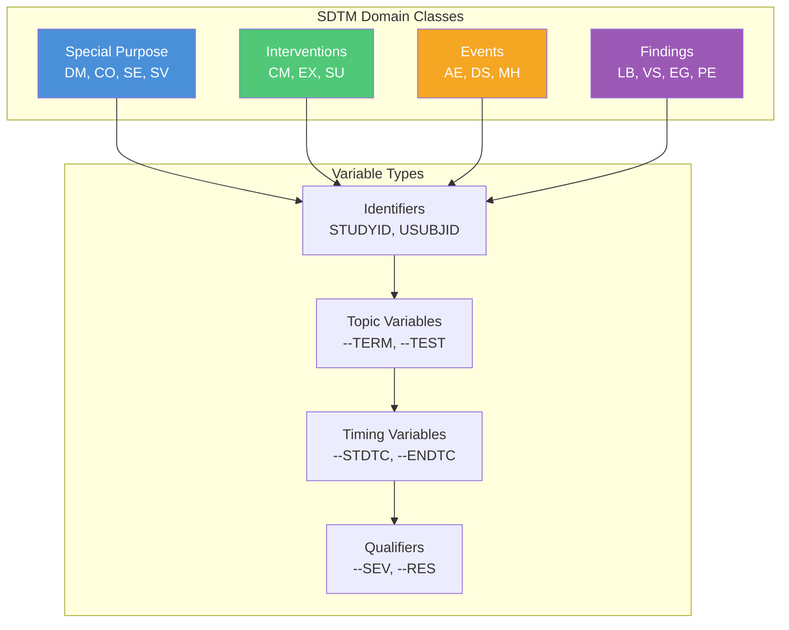

# SDTM Introduction

The Study Data Tabulation Model (SDTM) is the standard for organizing and formatting human clinical trial data for
submission to regulatory authorities.

## Purpose

SDTM provides:

- **Consistent structure** for clinical trial data
- **Standardized naming** conventions
- **Regulatory compliance** with FDA requirements
- **Interoperability** between systems and organizations

## Key Concepts

### Domains

SDTM organizes data into **domains** - logical groupings of related observations:

| Category            | Examples                                                                     |
|---------------------|------------------------------------------------------------------------------|
| **Special Purpose** | DM (Demographics), CO (Comments), SE (Subject Elements), SV (Subject Visits) |
| **Interventions**   | CM (Concomitant Meds), EX (Exposure), SU (Substance Use)                     |
| **Events**          | AE (Adverse Events), DS (Disposition), MH (Medical History)                  |
| **Findings**        | LB (Labs), VS (Vital Signs), EG (ECG), PE (Physical Exam)                    |

### Variables

Each domain contains **variables** - individual data elements:

| Type           | Description                  | Examples                 |
|----------------|------------------------------|--------------------------|
| **Identifier** | Subject/study identification | STUDYID, USUBJID, DOMAIN |
| **Topic**      | Focus of the observation     | AETERM, VSTEST, LBTEST   |
| **Timing**     | When observation occurred    | AESTDTC, VSDTC, VISITNUM |
| **Qualifier**  | Additional context           | AESEV, VSPOS, LBORRES    |

### Controlled Terminology

Many variables require values from **controlled terminology** (CT):

- Standardized value lists
- Ensures consistency across studies
- Required for regulatory submissions

## SDTM Structure

### General Observation Classes

1. **Interventions**: Treatments applied to subjects
2. **Events**: Occurrences during study participation
3. **Findings**: Observations and test results

### Variable Roles

| Role           | Purpose                     | Example          |
|----------------|-----------------------------|------------------|
| **Identifier** | Link records across domains | USUBJID          |
| **Topic**      | Describe the observation    | AETERM           |
| **Timing**     | Capture when                | AESTDTC          |
| **Qualifier**  | Provide context             | AESEV            |
| **Rule**       | Link to analysis rules      | (via Define-XML) |

## Working with SDTM in Trial Submission Studio

### Import Flow

1. Load source CSV data
2. Select target SDTM domain
3. Map source columns to SDTM variables
4. Handle controlled terminology
5. Validate against SDTM rules
6. Export to XPT format

### Variable Requirements

- **Required**: Must be present and populated
- **Expected**: Should be present if applicable
- **Permissible**: Allowed but not required

### Best Practices

1. **Map identifiers first**: STUDYID, DOMAIN, USUBJID
2. **Use controlled terminology**: For variables requiring CT
3. **Follow naming conventions**: Variable names, labels
4. **Validate early**: Catch issues before export

## SDTM Versions

Trial Submission Studio currently supports:

- **SDTM-IG 3.4** (current FDA standard)

### Version History

| Version | Release | Notes                |
|---------|---------|----------------------|
| 3.4     | 2021    | Current FDA standard |
| 3.3     | 2018    |                      |
| 3.2     | 2013    |                      |
| 3.1.2   | 2008    |                      |

## Next Steps

- [SDTM Domains](domains.md) - Domain reference
- [SDTM Variables](variables.md) - Variable details
- [Validation Rules](validation-rules.md) - Compliance checking
- [Controlled Terminology](../controlled-terminology.md) - CT reference
