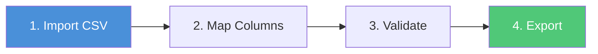
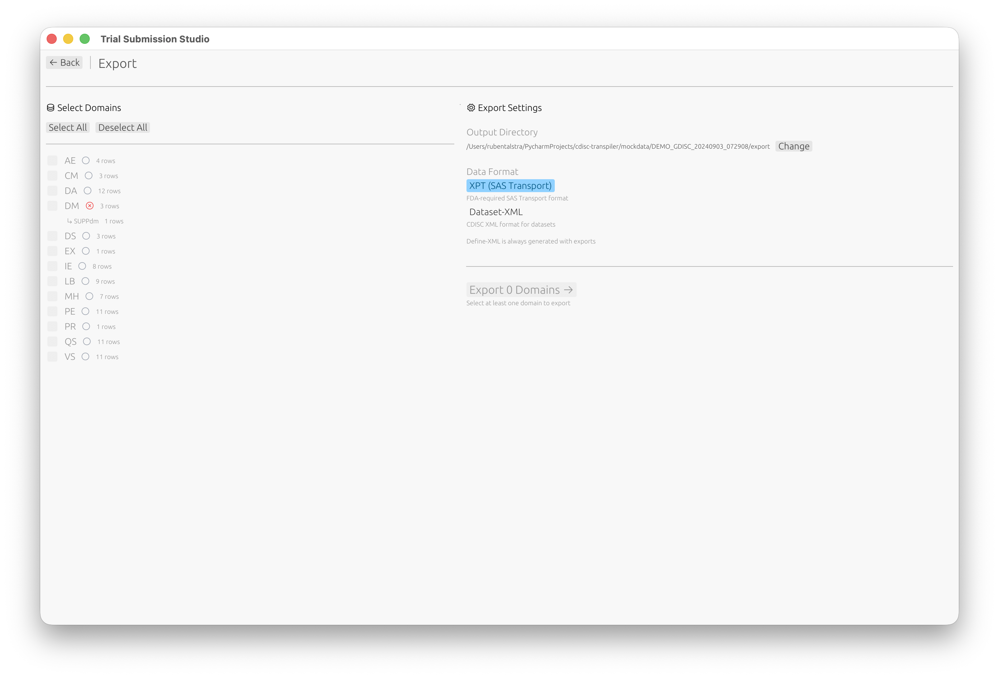

# Quick Start Guide

Get up and running with Trial Submission Studio in 5 minutes.

## Overview

This guide walks you through the basic workflow:

1. **Import** your source CSV data
2. **Map** columns to SDTM variables
3. **Validate** against CDISC standards
4. **Export** to XPT format

---

## Step 1: Launch the Application

After [installing](installation.md) Trial Submission Studio, launch the
application:

- **macOS**: Open from Applications folder
- **Windows**: Run `trial-submission-studio.exe`
- **Linux**: Run `./trial-submission-studio`

You'll see the welcome screen where you can select your CDISC standard:

---

## Step 2: Import Your Data

1. Click **Open Study Folder** and select your data folder
2. Trial Submission Studio will automatically:
   - Detect column types
   - Identify potential SDTM domains
   - Parse date formats

> [!TIP]
> Your data should have column headers in the first row.

---

## Step 3: Review Discovered Domains

Trial Submission Studio automatically discovers domains from your source data:

1. Review the list of discovered domains (DM, AE, VS, etc.)
2. Click on a domain to configure its mappings

---

## Step 4: Map Columns

1. Review the suggested column mappings
2. For each source column, select the corresponding SDTM variable
3. Use the fuzzy matching suggestions to speed up mapping

The mapping interface shows:

- **Source Column**: Your CSV column name
- **Target Variable**: The SDTM variable
- **Match Score**: Confidence of the suggested mapping (e.g., 93% match)

---

## Step 5: Validate

1. Switch to the **Validation** tab to check your data against CDISC rules
2. Review any validation messages:
   - **Errors**: Must be fixed before export
   - **Warnings**: Should be reviewed
   - **Info**: Informational messages

Each validation issue includes the rule ID, a description, and suggestions on how to fix it.

---

## Step 6: Export

1. Click **Go to Export** or navigate to the Export screen
2. Select which domains to export
3. Choose your output format:
   - **XPT (SAS Transport)** (FDA standard)
   - **Dataset-XML** (CDISC data exchange)
4. Click **Export**

---

## Next Steps

Now that you've completed the basic workflow:

- [Interface Overview](../user-guide/ui-overview.md) - Learn about all features
- [Column Mapping](../user-guide/column-mapping.md) - Advanced mapping
  techniques
- [Validation](../user-guide/validation.md) - Understanding validation rules
- [SDTM Standards](../cdisc-standards/sdtm/introduction.md) - SDTM reference
  guide
