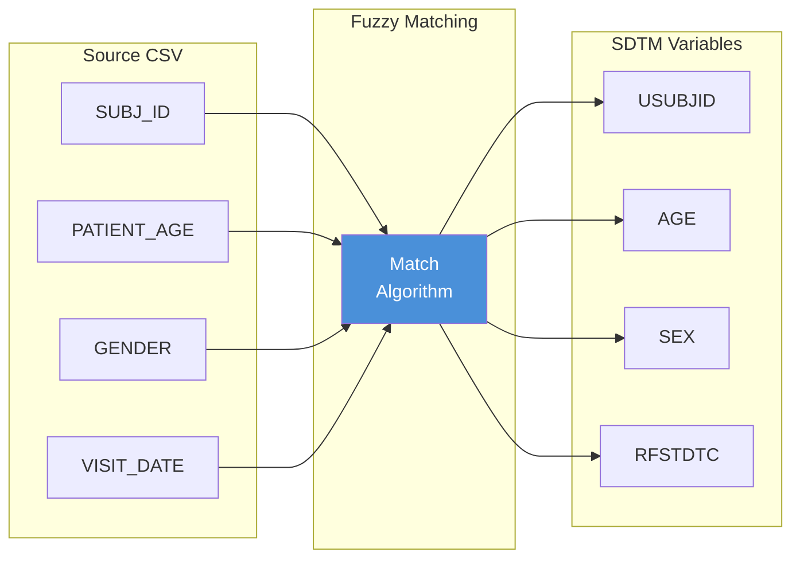
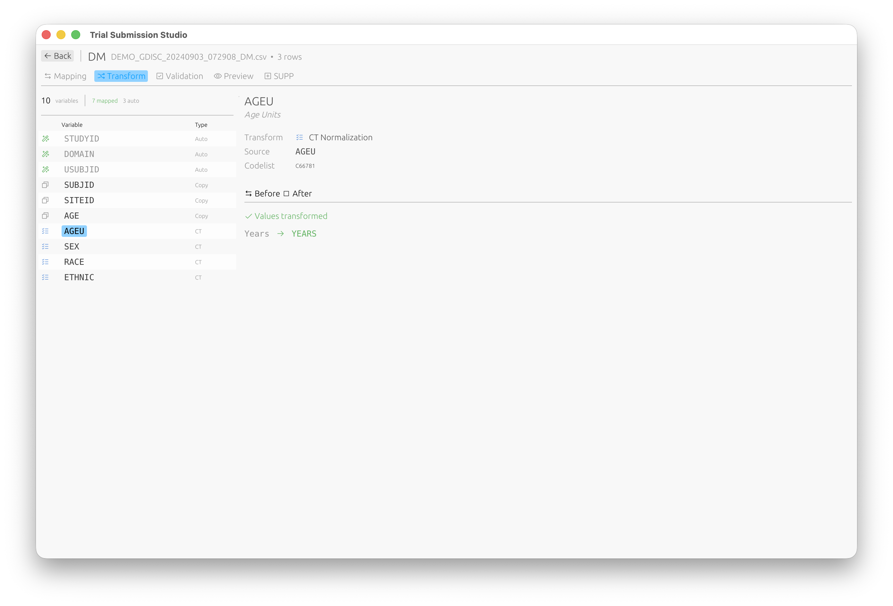
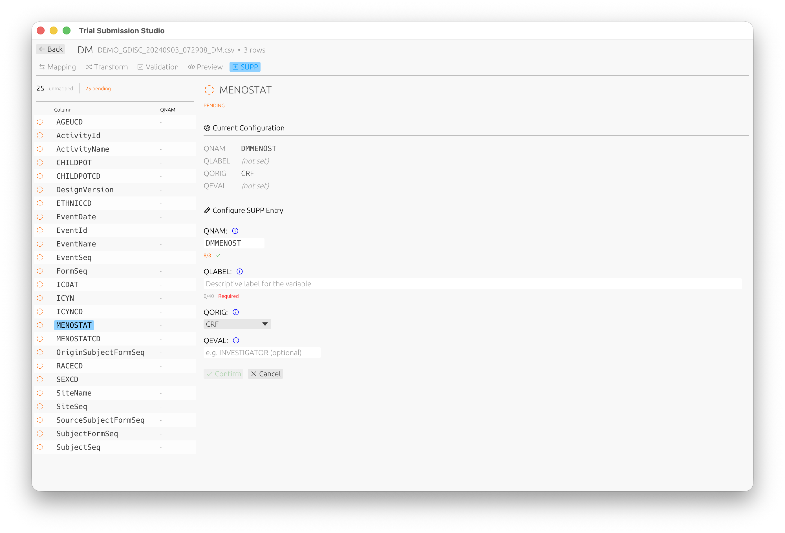

# Column Mapping

The mapping interface helps you connect your source CSV columns to SDTM variables.


## Overview

Column mapping is a critical step that defines how your source data transforms into SDTM-compliant output.



## The Mapping Interface

```
┌─────────────────────────────────────────────────────────────┐
│ Source Columns          │  Target Variables                 │
├─────────────────────────┼───────────────────────────────────┤
│ SUBJ_ID         ────────│──▶  USUBJID                       │
│ PATIENT_AGE     ────────│──▶  AGE                           │
│ GENDER          ────────│──▶  SEX                           │
│ VISIT_DATE      ────────│──▶  RFSTDTC                       │
│ RACE_DESC       ────────│──▶  RACE                          │
│ [Unmapped]              │     ETHNIC (Required)             │
└─────────────────────────┴───────────────────────────────────┘
```

## Automatic Mapping

Trial Submission Studio uses **fuzzy matching** to suggest mappings:

### How It Works

1. Analyzes source column names
2. Compares against SDTM variable names
3. Calculates similarity scores
4. Suggests best matches

### Match Confidence

- **High (>80%)** - Strong name similarity, auto-accepted
- **Medium (50-80%)** - Review recommended
- **Low (<50%)** - Manual mapping needed

### Example Matches

| Source Column | Suggested Variable | Confidence |
|---------------|--------------------|------------|
| `SUBJECT_ID`  | `USUBJID`          | 85%        |
| `AGE`         | `AGE`              | 100%       |
| `GENDER`      | `SEX`              | 75%        |
| `VSTESTVAL`   | `VSSTRESN`         | 70%        |

## Manual Mapping

### To Map a Column

1. Click on the source column
2. Click on the target variable
3. A connection line appears

### To Unmap a Column

1. Click on the connection line
2. Or right-click and select "Remove Mapping"

### To Change a Mapping

1. Remove the existing mapping
2. Create a new mapping

## Required vs Optional Variables

### Required Variables

Shown with a red indicator. Must be mapped for valid output:

- `STUDYID` - Study identifier
- `DOMAIN` - Domain abbreviation
- `USUBJID` - Unique subject identifier

### Optional Variables

Shown without indicator. Map if data is available.

### Expected Variables

Shown with yellow indicator. Expected for the domain but not strictly required.

## Data Type Considerations

The mapping interface warns about type mismatches:

| Warning             | Description                             |
|---------------------|-----------------------------------------|
| **Type Mismatch**   | Source is text, target is numeric       |
| **Length Exceeded** | Source values exceed SDTM length limits |
| **Format Warning**  | Date format needs conversion            |

## Controlled Terminology

For variables with controlled terminology:

- The interface shows valid values
- Warns if source values don't match
- Suggests value mappings

### CT Normalization

The Transform tab allows you to normalize values to CDISC Controlled Terminology:



Values are automatically transformed to their standardized form (e.g., "Years" → "YEARS").

## Supplemental Qualifiers (SUPP)

For non-standard variables that need to be captured as supplemental qualifiers, use the SUPP tab:



Configure QNAM, QLABEL, QORIG, and QEVAL for each supplemental qualifier variable.

## Mapping Templates

### Save a Template

1. Complete your mappings
2. **File → Save Mapping Template**
3. Name your template

### Load a Template

1. Import your data
2. **File → Load Mapping Template**
3. Select the template
4. Review and adjust as needed

## Best Practices

1. **Review all automatic mappings** - Don't blindly accept
2. **Map required variables first** - Ensure compliance
3. **Check controlled terminology** - Validate allowed values
4. **Save templates** - Reuse for similar datasets

## Next Steps

- [Validation](validation.md) - Validate your mappings
- [SDTM Variables](../cdisc-standards/sdtm/variables.md) - Variable reference
