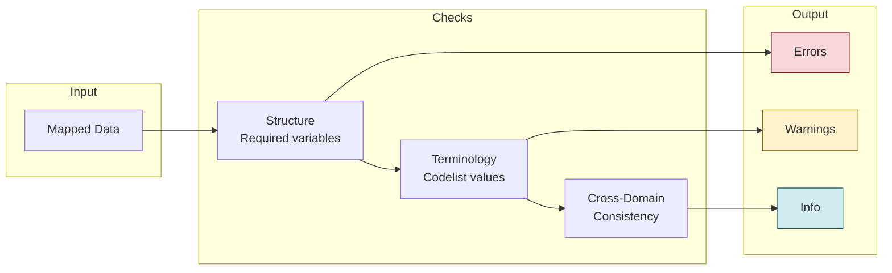

# Validation

Trial Submission Studio validates your data against CDISC standards before export.


## Validation Overview



Validation checks ensure your data:

- Conforms to SDTM structure
- Uses correct controlled terminology
- Meets FDA submission requirements

## Running Validation

### Automatic Validation

Validation runs automatically when you:

- Complete column mapping
- Make changes to mappings
- Prepare for export

### Manual Validation

Click **Validate** in the toolbar or press **Ctrl+R** (⌘R on macOS).

## Validation Results

### Result Categories

| Category    | Icon   | Description                       |
|-------------|--------|-----------------------------------|
| **Error**   | Red    | Must be fixed before export       |
| **Warning** | Yellow | Should be reviewed                |
| **Info**    | Blue   | Informational, no action required |

### Results Panel

```
┌─────────────────────────────────────────────────────────────┐
│ Validation Results                           [✓] [⚠] [ℹ]   │
├─────────────────────────────────────────────────────────────┤
│ ❌ SD0001: USUBJID is required but not mapped               │
│    Rows affected: All                                        │
│    Fix: Map a column to USUBJID                             │
├─────────────────────────────────────────────────────────────┤
│ ⚠️ CT0015: Value "M" not in SEX codelist                    │
│    Rows affected: 45, 67, 89                                │
│    Expected: MALE, FEMALE, UNKNOWN                          │
├─────────────────────────────────────────────────────────────┤
│ ℹ️ INFO: 1250 rows will be exported                         │
└─────────────────────────────────────────────────────────────┘
```

## Validation Rules

### Structural Rules

| Rule ID | Description               |
|---------|---------------------------|
| SD0001  | Required variable missing |
| SD0002  | Invalid variable name     |
| SD0003  | Variable length exceeded  |
| SD0004  | Invalid data type         |

### Controlled Terminology Rules

| Rule ID | Description           |
|---------|-----------------------|
| CT0001  | Value not in codelist |
| CT0002  | Codelist not found    |
| CT0003  | Invalid date format   |

### Cross-Domain Rules

| Rule ID | Description            |
|---------|------------------------|
| XD0001  | USUBJID not consistent |
| XD0002  | Missing parent record  |
| XD0003  | Duplicate keys         |

## Fixing Validation Errors

### Mapping Errors

1. Click on the error message
2. The relevant mapping is highlighted
3. Adjust the mapping or source data

### Data Errors

1. Note the affected rows
2. Correct the source data
3. Re-import and re-validate

### Terminology Errors

1. Review the expected values
2. Map source values to controlled terms
3. Or update source data to use standard terms

## Controlled Terminology Validation

### Supported Codelists

Trial Submission Studio includes embedded controlled terminology:

- CDISC CT 2025-09-26 (latest)
- CDISC CT 2025-03-28
- CDISC CT 2024-03-29

### Codelist Validation

For variables like SEX, RACE, COUNTRY:

- Source values are checked against valid terms
- Invalid values are flagged
- Suggestions for correct values are provided

## Validation Reports

### Export Validation Report

1. Complete validation
2. **File → Export Validation Report**
3. Choose format (PDF, HTML, CSV)
4. Save the report

### Report Contents

- Summary statistics
- All validation messages
- Affected data rows
- Recommendations

## Best Practices

1. **Validate early and often** - Fix issues as you go
2. **Address errors first** - Then warnings
3. **Document exceptions** - If warnings are intentional
4. **Keep validation reports** - For audit trails

## Next Steps

- [Exporting Data](exporting-data.md) - Export validated data
- [Controlled Terminology](../cdisc-standards/controlled-terminology.md) - CT reference
