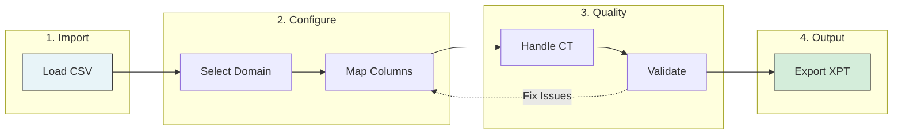

# Common Workflows

Step-by-step guides for typical Trial Submission Studio use cases.

## Workflow Overview



## Workflow 1: Demographics (DM) Domain

Transform demographics source data to SDTM DM domain.

### Source Data Example

```csv
SUBJECT_ID,AGE,SEX,RACE,ETHNIC,COUNTRY,SITE_ID
SUBJ001,45,Male,WHITE,NOT HISPANIC,USA,101
SUBJ002,38,Female,ASIAN,NOT HISPANIC,USA,102
SUBJ003,52,Male,BLACK,HISPANIC,USA,101
```

### Steps

1. **Import the CSV**
    - File → Import CSV
    - Select your demographics file

2. **Select DM Domain**
    - Click on "Domain Selection"
    - Choose "DM - Demographics"

3. **Map Columns**
   | Source | Target | Notes |
   |--------|--------|-------|
   | SUBJECT_ID | USUBJID | Subject identifier |
   | AGE | AGE | Age in years |
   | SEX | SEX | Maps to controlled terminology |
   | RACE | RACE | Controlled terminology |
   | ETHNIC | ETHNIC | Controlled terminology |
   | COUNTRY | COUNTRY | ISO 3166 codes |
   | SITE_ID | SITEID | Site identifier |

4. **Handle Controlled Terminology**
    - "Male" → "M" (or keep if using extensible CT)
    - "Female" → "F"
    - Review RACE and ETHNIC values

5. **Validate**
    - Click Validate
    - Address any errors

6. **Export**
    - Export → XPT V5
    - Save as `dm.xpt`

---

## Workflow 2: Adverse Events (AE) Domain

Transform adverse event data to SDTM AE domain.

### Source Data Example

```csv
SUBJECT_ID,AE_TERM,START_DATE,END_DATE,SEVERITY,SERIOUS
SUBJ001,Headache,2024-01-15,2024-01-17,MILD,N
SUBJ001,Nausea,2024-02-01,,MODERATE,N
SUBJ002,Rash,2024-01-20,2024-01-25,SEVERE,Y
```

### Steps

1. **Import CSV**
2. **Select AE Domain**
3. **Map Columns**
   | Source | Target | Notes |
   |--------|--------|-------|
   | SUBJECT_ID | USUBJID | |
   | AE_TERM | AETERM | Verbatim term |
   | START_DATE | AESTDTC | Start date |
   | END_DATE | AEENDTC | End date (can be blank) |
   | SEVERITY | AESEV | Controlled terminology |
   | SERIOUS | AESER | Y/N |

4. **Derive Required Variables**
    - AESEQ (sequence number) - auto-generated
    - AEDECOD (dictionary term) - if available

5. **Validate and Export**

---

## Workflow 3: Vital Signs (VS) Domain

Transform vital signs measurements to SDTM VS domain.

### Source Data Example

```csv
SUBJECT_ID,VISIT,TEST,RESULT,UNIT,DATE
SUBJ001,BASELINE,SYSBP,120,mmHg,2024-01-10
SUBJ001,BASELINE,DIABP,80,mmHg,2024-01-10
SUBJ001,WEEK 4,SYSBP,118,mmHg,2024-02-07
```

### Steps

1. **Import CSV**
2. **Select VS Domain**
3. **Map Columns**
   | Source | Target | Notes |
   |--------|--------|-------|
   | SUBJECT_ID | USUBJID | |
   | VISIT | VISIT | Visit name |
   | TEST | VSTESTCD | Test code |
   | RESULT | VSSTRESN | Numeric result |
   | UNIT | VSSTRESU | Result unit |
   | DATE | VSDTC | Collection date |

4. **Map Test Codes**
    - SYSBP → Systolic Blood Pressure
    - DIABP → Diastolic Blood Pressure

5. **Validate and Export**

---

## Workflow 4: Batch Processing

Process multiple domains from one source file.

### Source Data

A comprehensive dataset with columns for multiple domains.

### Steps

1. **Import the source file**
2. **Process each domain**
    - Filter relevant columns
    - Map to domain variables
    - Validate
3. **Batch Export**
    - File → Batch Export
    - Select all processed domains
    - Export to output folder

---

## Workflow 5: Re-processing with Template

Use a saved mapping template for similar data.

### Steps

1. **First Time Setup**
    - Import sample data
    - Create mappings
    - Save template: File → Save Mapping Template

2. **Subsequent Processing**
    - Import new data (same structure)
    - Load template: File → Load Mapping Template
    - Review and adjust if needed
    - Validate and export

---

## Tips for All Workflows

### Before You Start

- Review source data quality
- Identify required variables
- Prepare controlled terminology mappings

### During Processing

- Validate after each major step
- Document any decisions
- Keep notes on exceptions

### After Export

- Verify output files
- Run external validation
- Archive source and output files

## Next Steps

- [Troubleshooting](troubleshooting.md) - Common issues
- [SDTM Domains](../cdisc-standards/sdtm/domains.md) - Domain reference
